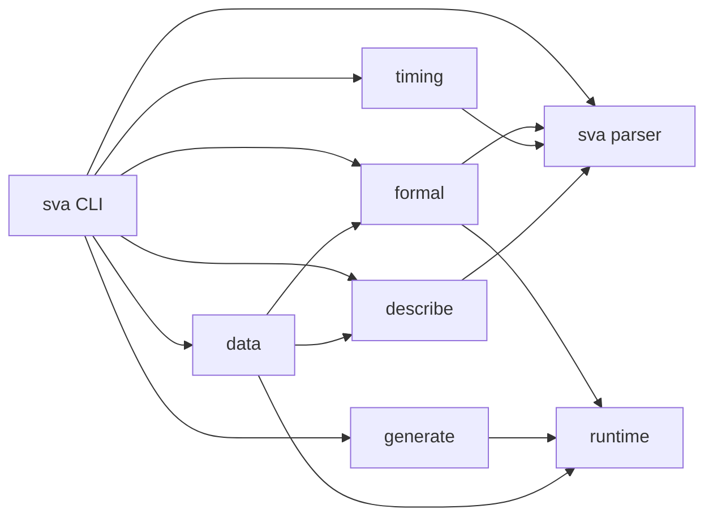

# Architecture

## Purpose

SVA Toolkit V3 consolidates the V2 runtime, parser, formal, and timing foundations with V1's generation, description, and data workflows behind one package and one CLI. The design goal is a single installable toolkit where every domain module can be used from Python or from `sva`.

## System Overview



## Module Relationships

| Module | Primary responsibility | Depends on |
| --- | --- | --- |
| `sva_toolkit.cli` | Command routing, output formatting, lazy imports | All public domains |
| `sva_toolkit.sva` | Parse and emit SVA ASTs | None |
| `sva_toolkit.formal` | Normalize practical property text and invoke formal backends | `runtime`, `sva` |
| `sva_toolkit.timing` | Parse timing DSL, render diagrams, bridge to and from SVA | `sva`, parts of `formal` metadata |
| `sva_toolkit.generate` | Synthesize legal SVA modules and compute coverage | `runtime` for optional Verible validation |
| `sva_toolkit.describe` | Translate SVA into SVAD and CoT markdown/text | `sva` |
| `sva_toolkit.data` | Build datasets and benchmark model outputs | `describe`, `formal`, `runtime` |
| `sva_toolkit.runtime` | Tool discovery, subprocess execution, config, LLM client | None |

## Data Flow

Typical workflows follow these paths:

1. Parse or ingest SVA text with `sva_toolkit.sva`.
2. Use the parsed structure in one of three directions:
   - `formal` normalizes it for EBMC or VC Formal.
   - `timing` extracts scenario documents or emits SVA from timing DSL.
   - `describe` renders human-readable explanations.
3. `generate` produces new SVA modules and can optionally validate syntax with Verible.
4. `data` composes `describe` and `formal` to build datasets and benchmark SVAD-driven generation tasks.
5. `runtime` owns all interaction with external executables and LLM APIs so import-time behavior stays lightweight.

## Runtime and External Dependencies

V3 keeps optional dependencies out of the import path:

- Formal backends are discovered via `ToolRegistry` at runtime.
- Verible is only needed for generator validation.
- `openai` is only imported when `LLMClient.generate()` is called.
- `cairosvg` is only needed for PNG rendering.

This keeps `sva parse`, `sva timing validate`, `sva describe ...`, and offline `sva data build` usable in a minimal Python environment.

## CLI Commands

The CLI is intentionally thin. `src/sva_toolkit/cli/main.py` handles:

- inline text vs file-path input loading
- JSON/text output formatting
- lazy import of each domain module
- environment-agnostic error translation into `click.ClickException`

Representative end-to-end flow:

```bash
sva parse examples/inputs/parse/req_ack.sv --format json
sva timing emit-sva examples/td/01_simple_handshake.td
sva describe cot examples/inputs/parse/req_ack.sv
sva data build examples/data/dataset_input.json -o examples/out/dataset.jsonl --workers 1
```

## API Reference

Top-level public entry points:

- `sva_toolkit.sva.parse_expr()`
- `sva_toolkit.sva.parse_sequence()`
- `sva_toolkit.sva.parse_property_body()`
- `sva_toolkit.sva.parse_property_text()`
- `sva_toolkit.formal.FormalService`
- `sva_toolkit.timing.render_diagram_svg()`
- `sva_toolkit.timing.render_diagram_png()`
- `sva_toolkit.generate.SVASynthesizer`
- `sva_toolkit.generate.StratifiedGenerator`
- `sva_toolkit.describe.SVADTranslator`
- `sva_toolkit.describe.SVACoTBuilder`
- `sva_toolkit.data.DatasetBuilder`
- `sva_toolkit.data.BenchmarkRunner`
- `sva_toolkit.runtime.ToolRegistry`
- `sva_toolkit.runtime.LLMClient`

## Related Docs

- [SVA parser](sva-parse.md)
- [Formal verification](sva-formal.md)
- [Timing diagrams](sva-timing.md)
- [SVA generation](sva-generate.md)
- [Description engine](sva-describe.md)
- [Data workflows](sva-data.md)
