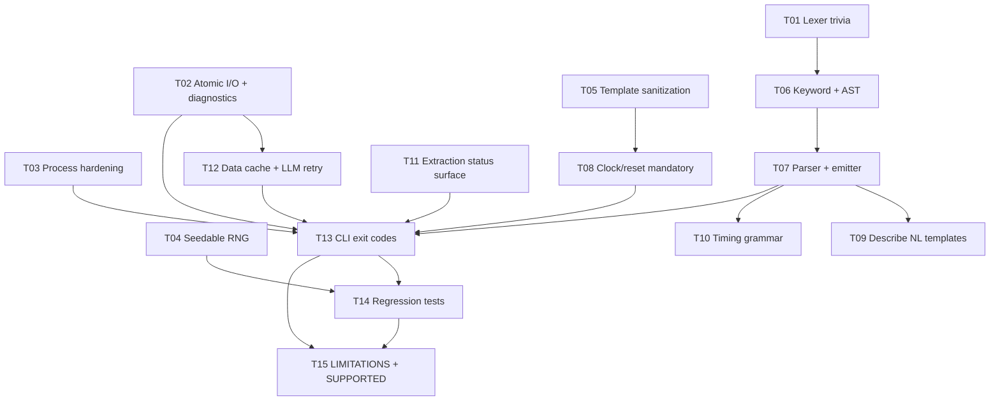

IGNORE THIS DOCUMENT IF YOU ARE A CODING LLM AGENT. THIS FILE IS FOR HUMAN REVIEW AND TASK DESIGN ONLY.

# SVA Toolkit V3 — Gap Remediation: Human Planning Document

This document plans the work required to fix (or formally document) every gap
enumerated in `docs/gaps.md`, and to produce two durable artifacts for end
users:

- `docs/LIMITATIONS.md` — exhaustive, stable list of the limitations that the
  toolkit **cannot** fix in this pass and that users must work around.
- `docs/SUPPORTED_FEATURES.md` — exhaustive list of what the toolkit **does**
  support after this gap pass, written so that downstream teams can decide
  whether the tool is suitable for their workflow.

The plan is expressed as a DAG of tasks suitable for parallel execution by
multiple coding LLM workers operating in isolated git worktrees. The task
boundaries have been chosen to minimize merge conflicts and to maximize the
amount of work that can progress independently in the first wave.

---

## 1. Project understanding

### 1.1 Purpose

SVA Toolkit V3 is a single installable Python package (`sva-toolkit`,
`python>=3.11`) that exposes six assertion-oriented workflows behind one unified
CLI (`sva`):

- `sva parse` — native lexer + parser for SVA property surfaces (no Verible
  dependency at parse time).
- `sva formal` — practical property normalization and external formal backend
  invocation (EBMC and VC Formal).
- `sva timing` — a timing-diagram DSL, SVG/PNG rendering, and bidirectional
  SVA ↔ DSL bridging.
- `sva generate` — type-directed assertion synthesis with optional Verible
  validation and construct-coverage reporting.
- `sva describe` — SVAD (structured natural-language) and CoT
  (chain-of-thought) rendering from parsed SVA.
- `sva data` — dataset building and benchmark runners that combine the
  description, formal, and optional LLM layers.

The package is organized as a disciplined set of domain modules with a thin
CLI layer (`src/sva_toolkit/cli/main.py`) and a central runtime helper layer
(`src/sva_toolkit/runtime/`) responsible for tool discovery, subprocess
invocation, config, and the LLM client.

### 1.2 Target users

- Verification engineers using the tool for **research**, ML dataset
  construction, documentation, and ad-hoc assertion experiments.
- ML researchers and tool-authors who need a deterministic, scriptable SVA
  corpus for training / evaluating SVA-generation models.
- Educators teaching SVA semantics and temporal-logic fundamentals.

The toolkit is explicitly **not** targeted today at tape-out-critical or
customer-facing sign-off flows; the gap document is explicit about this
(`docs/gaps.md` §8).

### 1.3 Architecture and module relationships

The architecture is captured in `docs/architecture.md`. In summary:

```
cli ─> { sva, formal, timing, generate, describe, data }
             │        │        │        │
             ▼        ▼        ▼        ▼
           sva     runtime  runtime  runtime
           (parser) (tools/ (tools/  (llm, cache)
                    proc)   proc)
```

Cross-cutting invariants:

- `sva_toolkit.sva` must remain the single source of truth for SVA syntax.
  Other domains do **not** re-implement tokenization.
- `sva_toolkit.runtime` owns every subprocess call, every filesystem-tempdir
  creation, and every LLM HTTP call.
- Optional dependencies (`openai`, `cairosvg`, `wavedrom`, `verible`, `ebmc`,
  `vcf`) must remain optional at import time and must degrade gracefully when
  absent.

### 1.4 Current implementation status

The package is `3.0.0a1` alpha. `docs/gaps.md` is an anchored, line-referenced
audit of the repo that enumerates the failure modes. The audit groups them
into five buckets:

1. **SVA syntax coverage gaps** (§2.1 – §2.8) — concrete IEEE 1800
   constructs that the lexer and parser do not recognize.
2. **Robustness weaknesses** (§3.1 – §3.9) — silent exception swallowing,
   regex-based parsing where grammar is needed, hard-coded clock/reset
   defaults, unsanitized Verilog generation, non-deterministic generation,
   cache-race conditions, subprocess orphans, non-atomic writes, lossy CLI
   errors.
3. **Per-tool gap matrix** (§4) — consolidated per-command deficiencies.
4. **Risk register** (§5) — 18 industrial-use risk items (R1–R18).
5. **Test-coverage gaps** (§6) — adversarial, concurrency, and tool-missing
   paths are thinly covered; there is no `coveragerc`.

### 1.5 Scope of this plan

This plan treats `docs/gaps.md` as the **specification of work**. Every task
in the DAG is anchored to a specific section of that document, and every
remaining-as-a-limitation item becomes a row in `docs/LIMITATIONS.md`.

The goal is **not** to rewrite the toolkit. It is to:

- Fix every gap that can be fixed in a focused, merge-friendly way without
  architectural upheaval.
- Honestly document the gaps that cannot reasonably be fixed in this pass.
- Leave behind a feature inventory that downstream users can audit.

---

## 2. Assumptions and observed discrepancies

### 2.1 Assumptions

- The existing V3 architecture (`docs/architecture.md`) is correct and should
  be preserved. No repackaging, no renaming, no new top-level modules beyond
  clearly scoped helper modules under existing packages.
- External tools (`ebmc`, `vcf`, `verible-verilog-syntax`, `cairosvg`) remain
  optional runtime dependencies. Gap fixes that require these tools must
  degrade gracefully when the tool is missing.
- `pyproject.toml` declares `click`, `pydantic` as core dependencies. Any new
  runtime dependency must be justified and ideally kept out of the base
  install (place behind an extra or vendor it).
- Python 3.11+ is the supported runtime, matching `requires-python>=3.11`.
- Test harness is `pytest` with `src` layout (`pythonpath=["src"]`). New tests
  go under `tests/<domain>/` mirroring the package layout.

### 2.2 Observed discrepancies between docs and code

- `docs/sva-formal.md` §"Operational Notes" states `backend="auto"` prefers
  VC Formal over EBMC, but `formal/service.py` uses a simple first-match
  discovery. No user-visible bug, but the behavior is worth confirming while
  T08 lands.
- `docs/sva-data.md` mentions CoT "is still produced" without `--model`.
  Code-wise, CoT generation is synchronous in `data/dataset.py` regardless of
  the LLM client — the doc is correct; the worker on T12 should preserve
  this contract.
- `docs/sva-parse.md` states "Parser behavior is property-centric". This is
  authoritative — T06/T07 must **not** extend the parser toward full RTL
  module parsing. We keep the scope to SVA property surfaces.
- `docs/gaps.md` §2.6 lists `$past` without a natural-language template, and
  `tests/describe/test_translator.py` today contains tests that inspect only
  the templated subset. T09 must add templates without breaking existing
  golden text.

### 2.3 Missing information

- `docs/gaps.md` does not specify which identifier-hostile edge cases (§3.4)
  have been seen in production RTL. T07 workers will conservatively reject
  anything that is not a strict SystemVerilog identifier per IEEE 1800 Annex.
- There is no explicit determinism contract documented anywhere, though §3.5
  implies it is desired. T04 will introduce a deterministic mode as the
  default for `sva generate` and document it as a supported feature.

---

## 3. Task decomposition strategy

### 3.1 Decomposition principles

1. **Vertical slicing by domain.** Each task targets one package (`sva`,
   `formal`, `timing`, `generate`, `describe`, `data`, `runtime`, `cli`). A
   single coding worker owns one slice end-to-end (source + tests + docstring
   updates).
2. **Foundation-first.** Shared infrastructure (atomic I/O, diagnostics,
   process hardening, sanitization, RNG context) is built first so that all
   downstream fixes compose cleanly.
3. **Shared hot files are isolated.** `cli/main.py`, `sva/lexer.py`,
   `sva/parser.py`, and `formal/backends/ebmc.py` are all merge hotspots.
   Tasks that touch them are serialized by dependency, not run in parallel.
4. **Additive before subtractive.** New diagnostic surfaces (warnings,
   counters, exit codes) are added before old silent paths are removed, so
   that intermediate states of the branch are still runnable.
5. **Docs land last.** `docs/LIMITATIONS.md` and `docs/SUPPORTED_FEATURES.md`
   are written after every fix has merged, so the content reflects ground
   truth rather than planning intent.

### 3.2 Boundaries that minimize merge conflicts

- **Lexer ↔ parser split (T01 vs T02/T06).** T01 modifies `sva/lexer.py`
  only for trivia/string/backtick handling. T02 (keyword expansion) depends
  on T01 and comes next. T06 (parser + emitter for new constructs) depends on
  T02. The three serialize on the same file but each leaves a clean diff.
- **Runtime splits.** `runtime/process.py` (T03), `runtime/atomic_io.py`
  (new, T02'), `runtime/llm.py` (T12), `runtime/diagnostics.py` (new, T02')
  are all separate files so foundation tasks do not collide.
- **Formal backend splits.** T05 modifies `formal/backends/ebmc.py` template
  and adds `formal/sanitize.py`. T08 modifies `formal/parse.py`,
  `formal/model.py`, and `formal/service.py` — a disjoint set of files.
  Coordination point: `formal/backends/ebmc.py` arguments that T08 passes
  in. The template signature from T05 is the handshake.
- **CLI is the last integration point.** Multiple tasks (T03, T05, T08, T11,
  T12) need to add flags or exit codes. T13 owns the final consolidation of
  `cli/main.py`. Earlier tasks stub their flag registration behind small
  helper functions the worker places under `cli/<task>_flags.py` or under
  `cli/<domain>/` so T13 can compose them.

### 3.3 Testing and integration partitioning

- **Unit tests go with their domain task.** Each task is responsible for
  shipping its own unit tests next to the source change under
  `tests/<domain>/`.
- **Integration and regression tests belong to T14.** T14 adds the
  end-to-end suite that exercises the updated CLI, determinism, race
  behavior, tool-missing paths, and silent-fallback visibility.
- **Fuzz/adversarial corpora** are carved out as part of T14 rather than
  each domain task, because the same corpus tends to exercise lexer,
  parser, and describe layers together.

### 3.4 Parallelism budget

- Wave 1 (foundation): 5 tasks in parallel (T01, T02, T03, T04, T05).
- Wave 2 (parser core): 2 serialized tasks (T06 after T02; T07 after T06).
- Wave 3 (domain): 5 tasks in parallel (T08, T09, T10, T11, T12).
- Wave 4 (integration): 1 task (T13 owns `cli/main.py`).
- Wave 5 (hardening & docs): 2 tasks in parallel (T14 tests, T15 docs).

---

## 4. Task DAG summary

### 4.1 Task catalogue

| ID   | Name                                           | Wave | Primary touched area                                        |
| ---- | ---------------------------------------------- | ---- | ----------------------------------------------------------- |
| T01  | Lexer trivia & preprocessor                    | 1    | `sva/lexer.py`, `sva/preprocessor.py`, `sva/trivia.py`       |
| T02  | Atomic I/O + central diagnostics utility       | 1    | `runtime/atomic_io.py`, `runtime/diagnostics.py`             |
| T03  | Process hardening & typed tool errors          | 1    | `runtime/process.py`, `runtime/errors.py`                    |
| T04  | Seedable generation RNG                        | 1    | `generate/rng.py`, `generate/synthesizer.py`, `stratified.py`|
| T05  | EBMC/VCF module template sanitization          | 1    | `formal/sanitize.py`, `formal/backends/ebmc.py`, `vcformal.py`|
| T06  | Lexer keyword expansion + AST nodes             | 2    | `sva/lexer.py`, `sva/ast.py`                                 |
| T07  | Parser + emitter for new constructs             | 2    | `sva/parser.py`, `sva/emitter.py`, `sva/diagnostics.py`      |
| T08  | Mandatory clock/reset annotation                | 3    | `formal/parse.py`, `formal/model.py`, `formal/service.py`   |
| T09  | Describe NL template expansion + uncertainty   | 3    | `describe/translator.py`, `describe/cot.py`                  |
| T10  | Timing DSL grammar-based parser                 | 3    | `timing/frontend/parser.py`, `timing/frontend/grammar.py`   |
| T11  | Timing extraction status surfacing              | 3    | `timing/bridge/from_sva.py`, `timing/bridge/status.py`       |
| T12  | Data cache locking, LLM retry, failure surface  | 3    | `data/dataset.py`, `data/benchmark.py`, `runtime/llm.py`    |
| T13  | CLI error reporting + typed exit codes         | 4    | `cli/main.py`, `cli/exit_codes.py`                           |
| T14  | Regression, determinism, concurrency tests     | 5    | `tests/**` (non-overlapping with T01–T13)                    |
| T15  | `LIMITATIONS.md` + `SUPPORTED_FEATURES.md`     | 5    | `docs/LIMITATIONS.md`, `docs/SUPPORTED_FEATURES.md`          |

### 4.2 Dependency edges

```
T01 ──► T06 ──► T07 ──► T09
T01 ──► T06 ──► T07 ──► T10 (indirectly, via shared emitter)
T02 ──► T12
T02 ──► T13
T03 ──► T13
T04 ──► T14
T05 ──► T08 ──► T13
T07 ──► T13
T11 ──► T13
T12 ──► T13
T13 ──► T14
T13 ──► T15
T14 ──► T15
```

### 4.3 Parallel execution groups

- **Group A (Wave 1, fully parallel):** {T01, T02, T03, T04, T05}.
- **Group B (Wave 2, serialized on `sva/lexer.py` and `sva/parser.py`):**
  T06 → T07.
- **Group C (Wave 3, parallel after foundations):** {T08, T09, T10, T11, T12}.
- **Group D (Wave 4, exclusive on `cli/main.py`):** {T13}.
- **Group E (Wave 5, parallel):** {T14, T15}.

### 4.4 Mermaid summary



---

## 5. Detailed task specifications

### T01 — Lexer trivia and SystemVerilog preprocessor handling

- **Task ID:** T01
- **Task name:** Lexer trivia and preprocessor tolerance
- **Objective:** Make `sva_toolkit.sva.lexer.tokenize` tolerant to the
  SystemVerilog source realities listed in `docs/gaps.md` §2.3: `//` and
  `/* … */` comments, `"…"` string literals, backtick preprocessor
  directives, line continuations (`\` at EOL), escaped identifiers
  (`\name-with-dashes `), and attribute instances `(* … *)`.
- **Why this task exists:** Every downstream parser and describe path assumes
  the lexer can survive real RTL input. Today it cannot; quoting from §2.3,
  "any real RTL/SVA file must be pre-stripped by the user before it can be
  fed in". This blocks R3, R10, R14.
- **Inputs / prerequisites:** None. This is a foundation task.
- **Files or directories likely to be touched:**
  - `src/sva_toolkit/sva/lexer.py` (main changes)
  - `src/sva_toolkit/sva/trivia.py` (new — `Trivia` dataclass and
    skip/collect helpers)
  - `src/sva_toolkit/sva/preprocessor.py` (new — minimal pass that strips
    or records `` `define``, `` `include``, `` `ifdef``, `` `ifndef``,
    `` `timescale``, attribute instances, encrypted-IP markers)
  - `tests/sva/test_lexer_trivia.py` (new)
  - `tests/sva/test_lexer_preprocessor.py` (new)
- **Files or directories to avoid:** Do not touch `sva/parser.py`,
  `sva/ast.py`, `sva/emitter.py`. Do not add new token kinds in this task —
  those belong to T06.
- **Expected deliverables:**
  - Trivia are skipped (comments, line continuations, attribute instances)
    or recorded but never emitted as `SvaSyntaxError`.
  - String literals are tokenized as a new `TokenKind.STRING` value.
  - Backtick directives are recognized at the preprocessor layer and either
    recorded as trivia or removed before tokenization. `` `define`` bodies
    are captured as opaque text for later optional expansion; this task
    does **not** perform macro substitution.
  - Escaped identifiers lex as `TokenKind.IDENT` with the backslash and
    trailing space stripped.
  - All existing `tests/sva/` continue to pass.
- **Suggested validation / tests:**
  - Feed every file under `examples/sva/` through `tokenize` after
    prefixing `// header comment`, `/* block comment */`, an attribute
    instance, and a string literal. Must not raise.
  - `` `define WIDTH 8`` `` `ifdef SIM``, `` `include "foo.svh"``,
    `` `timescale 1ns/1ps`` — all must either be stripped or surfaced as
    `Trivia`.
  - Negative case: malformed string literal (unterminated) must raise
    `SvaSyntaxError` with position info.
- **Merge conflict risk notes:** `sva/lexer.py` is a shared hot file. T06
  depends on this task; the worker should land T01 cleanly and in isolation
  before T06 starts.
- **Definition of done:**
  - All listed deliverables implemented.
  - New unit tests added and passing.
  - `ruff check src tests` clean.
  - `pytest -q tests/sva` green.

### T02 — Atomic file I/O utility and central diagnostics

- **Task ID:** T02
- **Task name:** Atomic write helper and project-wide diagnostic surface
- **Objective:** Provide a single helper for atomic text/JSON/JSONL writes
  and a single diagnostics façade used to report silent-fallback and
  opaque-downgrade events.
- **Why this task exists:** §3.1 and §3.8 identify silent fallbacks and
  non-atomic writes as blockers for reliability. Centralizing both in the
  runtime layer means every domain fix can re-use the same helper instead
  of duplicating patterns.
- **Inputs / prerequisites:** None.
- **Files or directories likely to be touched:**
  - `src/sva_toolkit/runtime/atomic_io.py` (new)
  - `src/sva_toolkit/runtime/diagnostics.py` (new)
  - `src/sva_toolkit/runtime/__init__.py` (export)
  - `tests/runtime/test_atomic_io.py` (new)
  - `tests/runtime/test_diagnostics.py` (new)
- **Files or directories to avoid:** Do not migrate any existing call sites
  to the new helper in this task. Call-site migration belongs to the domain
  task that owns each file (T12 for `data/`, T08 for `formal/`, T13 for
  `cli/`).
- **Expected deliverables:**
  - `atomic_write_text(path, content, *, encoding="utf-8")` that writes to
    `{path}.tmp.{pid}` and `os.replace`s.
  - `atomic_write_json(path, payload)` and `atomic_write_jsonl(path, rows)`.
  - A shared `sva_toolkit` `logging` logger with `NullHandler` by default
    and a `configure_cli_logging(verbosity)` helper that other tasks use.
  - A `Diagnostics` collector that tracks counts and categories of silent
    downgrades (e.g. `opaque_property`, `translator_fallback`,
    `lossy_extraction`) and can emit a summary at the end of a CLI run.
- **Suggested validation / tests:**
  - Atomic write: kill the process mid-write (simulated via monkeypatch of
    `os.replace` that raises); destination remains unchanged.
  - Concurrent atomic writes from two threads produce one coherent final
    file.
  - Diagnostics collector aggregates counts and renders a deterministic
    summary string.
- **Merge conflict risk notes:** Only new files. No merge risk.
- **Definition of done:** New modules exported, tested, documented via
  inline docstrings. No other files changed.

### T03 — Runtime process hardening

- **Task ID:** T03
- **Task name:** Subprocess session groups, typed tool errors
- **Objective:** Fix §3.7. Start subprocesses in a new session so that on
  `TimeoutExpired` the whole process group can be terminated. Differentiate
  "tool not installed" from "tool crashed" via typed errors.
- **Why this task exists:** R6 — orphaned EBMC/VCF helpers accumulate on CI
  boxes after every timeout.
- **Inputs / prerequisites:** None.
- **Files or directories likely to be touched:**
  - `src/sva_toolkit/runtime/process.py` (modified)
  - `src/sva_toolkit/runtime/errors.py` (new)
  - `tests/runtime/test_process.py` (extended)
  - `tests/runtime/test_process_orphans.py` (new)
- **Files or directories to avoid:** Do not change `runtime/tools.py` or
  `runtime/llm.py`. Do not touch `formal/backends/*`.
- **Expected deliverables:**
  - `run_tool` passes `start_new_session=True` on POSIX and uses
    `CREATE_NEW_PROCESS_GROUP` on Windows (or documents that orphan-kill
    is POSIX-only).
  - On `TimeoutExpired`, the process group is killed with `os.killpg`
    (POSIX) or `subprocess.Popen.terminate()` followed by `kill()`
    (Windows).
  - New `ToolMissingError(FileNotFoundError)` is raised when a tool is
    absent on `PATH`; callers can distinguish it from `RunResult` failure.
  - `make_work_dir` uses `tempfile.TemporaryDirectory` semantics or
    explicitly sets mode `0o700`.
- **Suggested validation / tests:**
  - Spawn a shell script that forks a grandchild; on timeout, the
    grandchild is reaped.
  - `ToolMissingError` raised for an absent binary; caught separately.
  - Cleanup errors are surfaced at WARNING, not swallowed.
- **Merge conflict risk notes:** `runtime/process.py` is imported from
  many sites but the public signature is preserved.
- **Definition of done:** Tests pass on macOS and Linux. Windows path is
  either implemented or explicitly listed in `LIMITATIONS.md`.

### T04 — Seedable generation RNG

- **Task ID:** T04
- **Task name:** Deterministic generation with `--seed`
- **Objective:** Fix §3.5. Thread an explicit `random.Random` instance
  through `SVASynthesizer`, `StratifiedGenerator`, and helpers. Expose a
  CLI `--seed` flag on `sva generate`. Produce byte-identical outputs for
  a given seed.
- **Why this task exists:** R5. Two `sva generate --count N` runs cannot be
  compared today; ML dataset builds cannot be reproduced.
- **Inputs / prerequisites:** None.
- **Files or directories likely to be touched:**
  - `src/sva_toolkit/generate/rng.py` (new — `GenerationRng` wrapper)
  - `src/sva_toolkit/generate/synthesizer.py` (inject rng everywhere)
  - `src/sva_toolkit/generate/stratified.py` (inject rng)
  - `src/sva_toolkit/generate/utils.py` (inject rng)
  - `src/sva_toolkit/cli/main.py` (add `--seed` flag; stub for T13
    composition — worker places logic in a small helper module
    `cli/generate_flags.py` if `main.py` touches must be minimized)
  - `tests/generate/test_determinism.py` (new)
- **Files or directories to avoid:** Do not touch the describe, formal, or
  data tasks' generation paths.
- **Expected deliverables:**
  - No `random.<x>()` module-level calls left in `generate/`; all sites go
    through `GenerationRng`.
  - `sva generate --seed 1234 --count N` produces byte-identical output on
    two runs.
  - Default `--seed` is a fresh OS random, but it is printed on stdout
    (or stderr with a quiet flag) so reproducers can capture it.
- **Suggested validation / tests:**
  - Run `generate_module` twice with the same seed; diff output equal.
  - Run twice with different seeds; output differs.
  - `ruff check` passes; no new globals.
- **Merge conflict risk notes:** `cli/main.py` — coordinate with T13.
  Worker lands flag wiring in a small patch that T13 absorbs.
- **Definition of done:** Determinism tests pass; seed appears in
  `SUPPORTED_FEATURES.md` as a first-class feature in T15.

### T05 — EBMC/VCF module template sanitization

- **Task ID:** T05
- **Task name:** Identifier validation before template splice
- **Objective:** Fix §3.4 / R4. Validate every signal name, clock name,
  reset expression, and body fragment against a conservative SystemVerilog
  identifier rule before splicing into the module template. Use
  `str.Template` or explicit `{}`-escaping to prevent `format` from
  raising on braces in user input.
- **Why this task exists:** Today a signal named `module` or a body
  containing `{` crashes the EBMC path with `KeyError` or a cryptic
  compile error from EBMC.
- **Inputs / prerequisites:** None.
- **Files or directories likely to be touched:**
  - `src/sva_toolkit/formal/sanitize.py` (new — reserved-words set,
    identifier regex, `escape_body_for_template`, exception types)
  - `src/sva_toolkit/formal/backends/ebmc.py` (call sanitizer, switch to
    `string.Template`)
  - `src/sva_toolkit/formal/backends/vcformal.py` (same)
  - `tests/formal/test_sanitize.py` (new)
- **Files or directories to avoid:** `formal/parse.py`, `formal/model.py`,
  `formal/service.py` — those are T08.
- **Expected deliverables:**
  - Identifier validator exported and used by both backends.
  - Reserved-words set covers IEEE 1800-2023 keywords that would collide
    with the template.
  - Body escape prevents `str.format`-style `{`/`}` crashes.
  - Hierarchical identifiers (`u_dut.req`) are rejected with a clear
    error message rather than producing broken SV.
- **Suggested validation / tests:**
  - Fuzz a corpus of identifier candidates; validator accepts iff they
    match the regex and are not reserved.
  - Body with literal braces is correctly escaped; template produces
    valid SV.
- **Merge conflict risk notes:** `formal/backends/ebmc.py` is also touched
  by T08. T08 depends on T05 to avoid rebase pain.
- **Definition of done:** Sanitizer unit tests + a new smoke test that
  drives `EbmcBackend.write_sv(...)` with hostile input.

### T06 — Lexer keyword expansion and AST nodes

- **Task ID:** T06
- **Task name:** Recognize IEEE 1800 SVA keywords at the token layer
- **Objective:** Fix §2.1 at the lexer and AST layers. Add all missing
  keyword tokens and introduce the placeholder AST nodes that T07 will fill
  in. Do **not** alter parsing behaviour in this task; opaque fallback
  stays in place.
- **Why this task exists:** The parser cannot expand coverage until the
  tokens exist. Doing tokens separately from parser semantics keeps the
  diff for each step reviewable.
- **Inputs / prerequisites:** T01 (trivia + preprocessor).
- **Files or directories likely to be touched:**
  - `src/sva_toolkit/sva/lexer.py` (expand `_KEYWORDS` and `TokenKind`;
    add two/three-char operators `->`, `<->`, `==>`)
  - `src/sva_toolkit/sva/ast.py` (add dataclasses for `Nexttime`,
    `Always`, `Eventually`, `Strong`, `Weak`, `Restrict`, `Expect`,
    `SequenceDecl`, `CheckerDecl`, `LetDecl`, `Bind`, `Within`,
    `Matched`, `Ended`, `Inside`, `Dist`, `MultiEventClocking`)
- **Files or directories to avoid:** `sva/parser.py`, `sva/emitter.py`,
  `describe/`, `formal/`, `timing/`.
- **Expected deliverables:**
  - Full coverage of §2.1 keyword list.
  - New AST dataclasses with `SourceSpan` fields and sensible
    `__repr__`/typing.
  - `tokenize("always req |-> ack")` produces the new `ALWAYS` token
    instead of an identifier.
- **Suggested validation / tests:**
  - Parametrized lexer tests confirming each new keyword produces its
    token.
  - AST dataclasses are instantiable and round-trip through `dataclasses.asdict`.
- **Merge conflict risk notes:** Serializes with T01 and T07 on
  `sva/lexer.py`. Only one active lexer task at a time.
- **Definition of done:** All lexer tests pass; AST import surface
  stable. `sva/parser.py` remains untouched.

### T07 — Parser + emitter for the new constructs

- **Task ID:** T07
- **Task name:** Expand property/sequence grammar, surface opaque counter
- **Objective:** Use the tokens from T06 to extend `parse_property_body`,
  `parse_sequence`, and `parse_expr` to handle the constructs listed in
  §2.4 (multi-edge clocking), §2.5 (property-level `implies`, `iff`,
  `s_until`, `s_until_with`, user-defined property instantiation),
  §2.7 (`[+]`, unbounded `[*]`, `$` infinity), and §2.8 (local variable
  typing). Update the emitter to round-trip the new nodes. Replace the
  silent `recover=True` downgrade with an explicit warning and
  `Diagnostics` counter bump.
- **Why this task exists:** R2 (silent downgrade) and coverage gaps that
  block every downstream consumer.
- **Inputs / prerequisites:** T06.
- **Files or directories likely to be touched:**
  - `src/sva_toolkit/sva/parser.py` (major)
  - `src/sva_toolkit/sva/emitter.py` (major)
  - `src/sva_toolkit/sva/diagnostics.py` (new — opaque counter)
  - `src/sva_toolkit/sva/transforms.py` (additive only — handle new nodes)
  - `src/sva_toolkit/sva/visitors.py` (additive only)
- **Files or directories to avoid:** Lexer (T01/T06), describe, formal.
- **Expected deliverables:**
  - Every §2.1 construct either parses to a typed node or raises with a
    clear message. Nothing silently becomes `OpaqueProperty` without a
    warning.
  - `parse_*` functions with `recover=True` still return opaque nodes but
    emit a `logging.warning` and bump a counter via the shared
    diagnostics module.
  - Emitter round-trips the full expanded grammar (existing
    `tests/sva/test_roundtrip.py` augmented with new cases).
- **Suggested validation / tests:**
  - Every new keyword/operator has a parse + emit round-trip test.
  - Negative test: malformed `always property (…)` without clocking
    raises `SvaSyntaxError` rather than silently downgrading.
  - Determinism: `opaque_count` equals zero on the golden corpus.
- **Merge conflict risk notes:** Serializes on `sva/parser.py` after T06.
  No parallel lexer work allowed.
- **Definition of done:** Parser coverage table in T15's
  `SUPPORTED_FEATURES.md` is ready to be filled in; `opaque_count == 0`
  for all existing `examples/sva/` inputs; `test_roundtrip.py` parametrized
  over the full grammar.

### T08 — Mandatory clock/reset annotation

- **Task ID:** T08
- **Task name:** Remove hard-coded `clk`/`!rst_n` defaults
- **Objective:** Fix §3.3 / R1. Make clock name, clock edge, and
  reset expression **mandatory** in `FormalProperty` unless the property
  text contains them. Expose `--clock`, `--clock-edge`, `--reset` on
  `sva formal {check,equivalent,relationship}`. Remove the silent
  defaults.
- **Why this task exists:** Hard-coded defaults can produce false EBMC
  verdicts on designs that use non-standard naming.
- **Inputs / prerequisites:** T05 (sanitizer so the new user-supplied
  clock/reset strings are validated before splicing).
- **Files or directories likely to be touched:**
  - `src/sva_toolkit/formal/parse.py`
  - `src/sva_toolkit/formal/model.py`
  - `src/sva_toolkit/formal/service.py`
  - `src/sva_toolkit/cli/main.py` (add flags — coordinate with T13)
  - `tests/formal/test_parse.py`, `test_service.py`, `test_model.py`
- **Files or directories to avoid:** Backend templates (T05 already
  owns the splice layer).
- **Expected deliverables:**
  - Defaults for `clock_name`, `clock_edge`, and `reset_expr` removed
    from `_parse_property_fallback`.
  - `FormalService.check_implication(...)` signature accepts `clock`,
    `clock_edge`, `reset` keyword arguments and raises if the antecedent
    and consequent disagree after normalization.
  - CLI flags plumbed through with sensible error messages if they are
    required but missing.
  - Equivalence semantic comparator (`!rst_n` vs `rst_n == 0`) — at
    minimum, tokenize both sides and compare token streams modulo
    whitespace, instead of raw-string equality.
- **Suggested validation / tests:**
  - Property with explicit clock + reset is accepted unchanged.
  - Property with no clocking and no CLI flag raises a clear
    `ClickException("explicit --clock is required because the property
    text does not name one")`.
  - Equivalence still detects `!rst_n` ≡ `rst_n == 0`.
- **Merge conflict risk notes:** `cli/main.py` shared with T13. Use
  helper module `cli/formal_flags.py` and let T13 compose.
- **Definition of done:** R1 crossed off in the risk register; doc cross-
  link added in T15.

### T09 — Describe NL template expansion + uncertainty

- **Task ID:** T09
- **Task name:** Fill in missing natural-language templates, expose
  uncertainty
- **Objective:** Fix §2.6 and §4.5. Add NL templates for every system
  function recognized by the lexer (`$past`, `$sampled`, `$rewind`,
  `$past_gclk`, `$future_gclk`, `$assertcontrol` family, `$error`,
  `$fatal`, `$warning`, `$info`). When `OpaqueProperty` / `OpaqueSequence`
  / `OpaqueExpr` nodes appear in the AST, emit a visible "unverified
  fragment" marker in the description and in the CoT breakdown.
- **Why this task exists:** R2 and R9 — today a fully-understood property
  and a mostly-verbatim passthrough look identical to a human reader.
- **Inputs / prerequisites:** T07 (new AST nodes must exist so the
  translator can dispatch on them).
- **Files or directories likely to be touched:**
  - `src/sva_toolkit/describe/translator.py`
  - `src/sva_toolkit/describe/cot.py`
  - `tests/describe/test_translator.py`, `test_cot.py`
- **Files or directories to avoid:** `sva/parser.py` (owned by T07).
- **Expected deliverables:**
  - Templates for every lexed system function.
  - Opaque nodes render with a distinct prefix (e.g. `"[unverified]"`)
    and increment the diagnostics opaque counter.
  - CoT builder emits an explicit "low-confidence" paragraph when any
    opaque node is in the tree.
- **Suggested validation / tests:**
  - Template coverage test: every `$ident` token produced by the lexer
    has a template unless explicitly exempt.
  - CoT uncertainty test: a property with a deliberately malformed inner
    sequence yields a CoT with an `[unverified]` tag.
- **Merge conflict risk notes:** Describe is a contained package.
- **Definition of done:** Coverage table in `SUPPORTED_FEATURES.md`
  includes describe templates.

### T10 — Timing DSL grammar-based parser

- **Task ID:** T10
- **Task name:** Replace regex-per-line DSL parser with a grammar
- **Objective:** Fix §3.2 in the timing frontend. Replace
  `timing/frontend/parser.py`'s single-line regex table with a
  tokenize-and-parse pipeline. Comments on the same line, embedded
  parentheses, and multi-line declarations must parse cleanly.
- **Why this task exists:** The DSL parser is brittle under any syntactic
  extension and recovers poorly on malformed input.
- **Inputs / prerequisites:** None (independent of the SVA parser).
- **Files or directories likely to be touched:**
  - `src/sva_toolkit/timing/frontend/parser.py`
  - `src/sva_toolkit/timing/frontend/grammar.py` (new — tokens + simple
    recursive-descent parser)
  - `src/sva_toolkit/timing/frontend/validate.py`
  - `tests/timing/test_grammar_parser.py` (new)
- **Files or directories to avoid:** `timing/bridge/*`.
- **Expected deliverables:**
  - All existing `examples/td/*.td` files continue to parse.
  - Trailing `# comment` on any line is tolerated.
  - Multi-line declarations (signals with wrapped attribute lists)
    parse.
  - A clear error recovery strategy — on parse failure, report the line
    and column instead of failing the whole file.
- **Suggested validation / tests:**
  - Parametrized test over the entire `examples/td/` suite.
  - Negative: a `.td` file with a dangling parenthesis yields a precise
    error.
- **Merge conflict risk notes:** Self-contained.
- **Definition of done:** Existing integration tests remain green; the
  new grammar-based path is the default.

### T11 — Timing extraction status surfacing

- **Task ID:** T11
- **Task name:** Propagate `LOSSY` and `UNSUPPORTED` to the CLI
- **Objective:** Fix §4.3 by elevating `ExtractionStatus` to a user-
  visible signal. When `sva timing extract-sva` / `bundle-sva` returns
  any non-`EXACT` status, the CLI must print a warning and set a distinct
  exit code (to be reserved by T13).
- **Why this task exists:** R9 — lossy diagrams can ship silently today.
- **Inputs / prerequisites:** T02 (diagnostics).
- **Files or directories likely to be touched:**
  - `src/sva_toolkit/timing/bridge/from_sva.py`
  - `src/sva_toolkit/timing/bridge/status.py` (new — canonical
    `ExtractionReport` with counts and a `worst_status()` helper)
  - `tests/timing/test_extraction_status.py` (new)
- **Files or directories to avoid:** `sva/parser.py`, describe, formal.
- **Expected deliverables:**
  - `ExtractionReport` returned from public API.
  - Broad `except Exception` at `578, 1462, 1486, 1517` replaced with
    targeted catches that record the exception type on the report.
- **Suggested validation / tests:**
  - Feeding an unsupported operator yields an `ExtractionReport` with
    `status == UNSUPPORTED` and a non-empty `reasons` list.
- **Merge conflict risk notes:** `from_sva.py` is 1646 lines; plan diffs
  to be surgical.
- **Definition of done:** Worker hands T13 a helper that translates the
  report into an exit code.

### T12 — Data cache locking, LLM retry, failure surfacing

- **Task ID:** T12
- **Task name:** Multiprocess-safe cache + retrying LLM client
- **Objective:** Fix §3.6. Guard `_write_cached_result` with a file lock
  (use `filelock` if available; else fall back to `fcntl.flock`
  on POSIX). Add a cache version sentinel. Add exponential backoff +
  jitter to `LLMClient.generate()` with `Retry-After` support. Surface
  translator fallback events via the shared diagnostics collector.
- **Why this task exists:** R7, R8.
- **Inputs / prerequisites:** T02 (atomic I/O, diagnostics).
- **Files or directories likely to be touched:**
  - `src/sva_toolkit/data/dataset.py`
  - `src/sva_toolkit/data/benchmark.py`
  - `src/sva_toolkit/runtime/llm.py`
  - `src/sva_toolkit/runtime/retry.py` (new — generic retry decorator)
  - `tests/data/test_cache_locking.py` (new)
  - `tests/data/test_llm_retry.py` (new)
- **Files or directories to avoid:** Formal, timing, describe.
- **Expected deliverables:**
  - Cache schema version bumped; unmatched versions are ignored, not
    consumed.
  - Two concurrent writers to the same key produce exactly one final
    file.
  - Retry handles `429`, `5xx`, `httpx.TimeoutException`, bounded by a
    configurable `max_retries`. After retries exhaust, the fallback is
    logged at WARNING and counted in diagnostics.
  - CLI surfaces `svad_source` mix at the end of `sva data build`.
- **Suggested validation / tests:**
  - Parallel build over a small dataset — no corrupted cache file after
    many runs.
  - Mocked OpenAI client returning `429` first, then `200` — retry
    succeeds.
  - Mocked client returning persistent `500` — fallback path is taken
    and logged.
- **Merge conflict risk notes:** `runtime/llm.py` is touched here only.
- **Definition of done:** R7 and R8 closed; tests for both failure modes
  land with the task.

### T13 — CLI error reporting + typed exit codes

- **Task ID:** T13
- **Task name:** Replace generic `click.ClickException(str(exc))` with
  typed exit codes and visible diagnostics
- **Objective:** Fix §3.9 / R17. Reserve stable exit codes per category
  (0 success, 1 generic error, 2 usage error, 3 tool missing, 4 parse
  error, 5 timeout, 6 lossy extraction, 7 backend unavailable). Compose
  the per-task CLI flag modules added by T04, T08, T11. Surface
  diagnostics summaries in verbose mode.
- **Why this task exists:** CI pipelines cannot discriminate failure
  types today. Every uncaught exception becomes exit 1.
- **Inputs / prerequisites:** T03, T08, T11, T12, T02.
- **Files or directories likely to be touched:**
  - `src/sva_toolkit/cli/main.py` (owned here this wave)
  - `src/sva_toolkit/cli/exit_codes.py` (new)
  - `tests/cli/test_exit_codes.py` (new)
- **Files or directories to avoid:** Domain packages.
- **Expected deliverables:**
  - `_handle_cli_errors` maps typed exceptions (`ToolMissingError`,
    `SvaSyntaxError`, `TimeoutError`, `LossyExtractionError`,
    `BackendUnavailableError`) to distinct exit codes.
  - `--verbose` flag renders full traceback.
  - All per-task `cli/*_flags.py` composed into the Click command tree.
- **Suggested validation / tests:**
  - `sva formal check ...` with no `ebmc`/`vcf` → exit 3, clear message.
  - `sva parse "bogus"` → exit 4.
  - Timeouts in `sva data build` → exit 5.
- **Merge conflict risk notes:** Exclusive wave on `cli/main.py`.
- **Definition of done:** All exit codes documented in
  `SUPPORTED_FEATURES.md`.

### T14 — Regression, determinism, concurrency tests

- **Task ID:** T14
- **Task name:** Expand the adversarial and integration suite
- **Objective:** Fix §6. Add tests that prove every fixed gap stays
  fixed and exercise the adversarial corpora that today are thinly
  covered.
- **Why this task exists:** Without a regression suite, these gaps will
  re-open as the toolkit evolves.
- **Inputs / prerequisites:** T01–T13.
- **Files or directories likely to be touched:**
  - `tests/integration/test_opaque_surfacing.py` (new)
  - `tests/integration/test_determinism.py` (new)
  - `tests/integration/test_cache_race.py` (new)
  - `tests/integration/test_orphans.py` (new; POSIX-only)
  - `tests/integration/test_tool_missing.py` (new)
  - `tests/integration/test_large_inputs.py` (new smoke test)
  - `tests/conftest.py` helpers as needed
  - `tests/fixtures/sva_corpus/` (new — small adversarial files)
- **Files or directories to avoid:** Source code changes (must be
  exclusively tests and fixtures).
- **Expected deliverables:**
  - Every risk R1–R18 has at least one regression test.
  - Adversarial lexer inputs (comments, strings, encrypted-IP markers)
    have fixtures.
  - `pytest-cov` optional invocation in `pyproject.toml` added under the
    `dev` extra.
- **Suggested validation / tests:** The suite itself.
- **Merge conflict risk notes:** Tests only. No source conflicts.
- **Definition of done:** `pytest -q` green; coverage on `src/` ≥ 80%
  (soft target).

### T15 — `LIMITATIONS.md` + `SUPPORTED_FEATURES.md`

- **Task ID:** T15
- **Task name:** User-facing limitation + feature inventories
- **Objective:** Produce the two final reference documents requested by
  the user brief. Content is composed from the ground-truth state of the
  repo after T01–T14 land.
- **Why this task exists:** The user asked for both documents by name.
  The planning doc does not replace them.
- **Inputs / prerequisites:** T01–T14.
- **Files or directories likely to be touched:**
  - `docs/LIMITATIONS.md` (new)
  - `docs/SUPPORTED_FEATURES.md` (new)
- **Files or directories to avoid:** Source.
- **Expected deliverables:**
  - `LIMITATIONS.md` lists every item from `docs/gaps.md` that was
    **not** fixed, with an explicit reason (out-of-scope, requires
    vendor tool, requires architectural rewrite, etc.), an ID, and a
    workaround when available.
  - `SUPPORTED_FEATURES.md` enumerates, per CLI command:
    - the SVA constructs that parse and round-trip,
    - the NL templates the describe engine supports,
    - the formal check semantics and their exit codes,
    - the timing DSL constructs,
    - the generation flags including `--seed`,
    - the dataset/benchmark supported flows,
    - every extra (`timing-render`, `llm`, `all`) and what it gates.
  - Both documents cross-link to the source file(s) that implement each
    feature.
- **Suggested validation / tests:** A CI check that verifies each item
  in `LIMITATIONS.md` has a unique `L-xx` ID and each item in
  `SUPPORTED_FEATURES.md` has a unique `F-xx` ID (optional, lightweight
  validator script).
- **Merge conflict risk notes:** Docs only.
- **Definition of done:** Two documents landed; `docs/gaps.md` gains a
  closing note linking to both.

---

## 6. Prompt for each coding worker task

Each prompt is self-contained and follows the template in the user brief.

### 6.1 Prompt — T01

You are a coding worker assigned to T01: Lexer trivia and preprocessor tolerance.

Before doing anything, read:

- docs/gaps.md (§2.3, §2.4, §2.8)
- docs/sva-parse.md
- docs/architecture.md
- docs/task_dag_shared.md

Your task objective:

Make `sva_toolkit.sva.lexer.tokenize` tolerant to real SystemVerilog source
realities: `//` line comments, `/* … */` block comments, `"…"` string
literals, backtick preprocessor directives (`` `define``, `` `include``,
`` `ifdef``, `` `ifndef``, `` `endif``, `` `timescale``), line continuations
(`\` at EOL), escaped identifiers (`\foo-bar `), and attribute instances
`(* attr = "val" *)`. Do not expand the keyword set in this task; that is
T06.

Dependency check:

- Required completed tasks: none.
- If any dependency is not DONE, do not proceed blindly. Record the blocker
  in docs/task_dag_shared.md.

Focus areas:

- `src/sva_toolkit/sva/lexer.py`
- `src/sva_toolkit/sva/trivia.py` (new)
- `src/sva_toolkit/sva/preprocessor.py` (new)
- `tests/sva/test_lexer_trivia.py` (new)
- `tests/sva/test_lexer_preprocessor.py` (new)

(Note: The files you need to work on have already been scaffolded. Read the
summary paragraph at the top of each file to ensure your implementation
aligns with the intended architecture.)

Avoid touching unless absolutely necessary:

- `src/sva_toolkit/sva/parser.py`
- `src/sva_toolkit/sva/ast.py`
- `src/sva_toolkit/sva/emitter.py`
- Any file outside `src/sva_toolkit/sva/` or `tests/sva/`.

Implementation requirements:

- Introduce a `Trivia` dataclass capturing kind (comment_line,
  comment_block, directive, attribute, whitespace, line_continuation),
  span, and original text.
- Extend `tokenize` to skip trivia by default but return a secondary
  sequence for callers that want it (keep backwards compatibility by not
  altering the primary return type).
- Introduce a `TokenKind.STRING` value for `"…"` literals; escape handling
  must cover `\"`, `\\`, `\n`, `\t` at minimum.
- Handle backtick directives at a preprocessor pass that runs before
  `tokenize`; record but do not expand macro bodies.
- Reject malformed inputs (unterminated comment, unterminated string) with
  precise `SvaSyntaxError`.

Validation requirements:

- `pytest -q tests/sva` green, including the new trivia and preprocessor
  tests.
- Run `tokenize` over every file in `examples/sva/` with a leading
  `// header` and an inline `/* block */` — no exception.
- `ruff check src tests` clean.

Rules:

- Replace the placeholder summary paragraph in the scaffolded files with
  your actual, production-ready implementation.
- Keep changes minimal and merge-friendly.
- Do not perform unrelated refactors.
- Preserve documented architecture unless the task explicitly requires
  architectural changes.
- If you must change task scope, record it explicitly in
  docs/task_dag_shared.md.
- Before finishing, update the task status table and append an entry to the
  update log.
- If incomplete, record what is already done, what files were touched, what
  remains, blockers / uncertainties, and recommended next steps for the
  next worker.

### 6.2 Prompt — T02

You are a coding worker assigned to T02: Atomic file I/O utility and
central diagnostics.

Before doing anything, read:

- docs/gaps.md (§3.1, §3.8)
- docs/architecture.md
- docs/task_dag_shared.md

Your task objective:

Introduce two small, foundational helpers in `runtime/`:

1. `atomic_io.py` — `atomic_write_text(path, content)`,
   `atomic_write_json(path, payload)`, `atomic_write_jsonl(path, rows)`.
2. `diagnostics.py` — a `Diagnostics` collector that tracks the
   categories of silent fallbacks (opaque_property, translator_fallback,
   lossy_extraction, cache_miss, retry_exhausted) and renders a summary.
   Also expose a configured `logging.Logger` via
   `configure_cli_logging(verbosity)`.

Dependency check:

- Required completed tasks: none.

Focus areas:

- `src/sva_toolkit/runtime/atomic_io.py` (new)
- `src/sva_toolkit/runtime/diagnostics.py` (new)
- `src/sva_toolkit/runtime/__init__.py` (add exports)
- `tests/runtime/test_atomic_io.py` (new)
- `tests/runtime/test_diagnostics.py` (new)

Avoid touching unless absolutely necessary:

- Call sites of the old write patterns — migration belongs to the domain
  tasks (T08, T11, T12, T13).

Implementation requirements:

- `atomic_write_text` writes to a sibling `.tmp.<pid>` file and calls
  `os.replace` for atomic publish.
- `atomic_write_json` and `atomic_write_jsonl` call the text helper.
- Simulated failure mid-write leaves the target path unchanged.
- `Diagnostics` is thread-safe.
- No new third-party dependencies.

Validation requirements:

- `pytest -q tests/runtime` green.
- `ruff check` clean.
- Determinism: two sequential writes of the same content yield identical
  bytes and a single final file.

Rules:

- Replace the placeholder summary paragraph in the scaffolded files with
  your actual implementation.
- Keep changes minimal. No changes outside `runtime/` and `tests/runtime/`.
- Before finishing, update docs/task_dag_shared.md status and log.

### 6.3 Prompt — T03

You are a coding worker assigned to T03: Runtime process hardening and
typed tool errors.

Before doing anything, read:

- docs/gaps.md (§3.7)
- docs/architecture.md
- docs/task_dag_shared.md

Your task objective:

Strengthen `runtime/process.py` so that subprocess timeouts terminate the
entire process group (no orphaned EBMC/VCF children), and introduce a
typed `ToolMissingError` so callers can distinguish an absent binary from
a crashed one.

Dependency check:

- Required completed tasks: none.

Focus areas:

- `src/sva_toolkit/runtime/process.py` (modified)
- `src/sva_toolkit/runtime/errors.py` (new)
- `tests/runtime/test_process.py` (extended)
- `tests/runtime/test_process_orphans.py` (new, POSIX-only; skip on
  Windows with pytest.skip marker)

Avoid touching unless absolutely necessary:

- `runtime/tools.py`, `runtime/llm.py`, `runtime/config.py`
- Every `formal/backends/*.py` file.

Implementation requirements:

- POSIX: pass `start_new_session=True` and, on `TimeoutExpired`, call
  `os.killpg(pgid, signal.SIGKILL)` after a SIGTERM grace period.
- Windows: best-effort `Popen.terminate()` + `kill()`; document the
  orphan-kill caveat in a source docstring and flag it for
  `LIMITATIONS.md`.
- Replace the blanket `RuntimeError(f"Failed to execute tool: {cmd}")`
  with `ToolMissingError(path, cmd)` for `FileNotFoundError`.
- `make_work_dir` enforces `0o700` mode (POSIX) and uses
  `tempfile.mkdtemp(..., dir=runtime.config.workdir_root())` if that
  helper exists.

Validation requirements:

- New `test_process_orphans.py` spawns a shell script that forks a
  grandchild (`sh -c 'sleep 60 & sleep 60'`) and asserts the grandchild
  is reaped on timeout.
- `ToolMissingError` is raised and caught as a distinct subclass of
  `FileNotFoundError`.

Rules:

- Replace the placeholder summary paragraph in each scaffolded file with
  your actual implementation.
- Preserve the public `run_tool` and `RunResult` surface.
- Update docs/task_dag_shared.md status and append to the log.

### 6.4 Prompt — T04

You are a coding worker assigned to T04: Seedable generation RNG.

Before doing anything, read:

- docs/gaps.md (§3.5)
- docs/sva-generate.md
- docs/architecture.md
- docs/task_dag_shared.md

Your task objective:

Eliminate non-determinism from the generator by threading an explicit RNG
instance through every call site and exposing it on the CLI.

Dependency check:

- Required completed tasks: none.

Focus areas:

- `src/sva_toolkit/generate/rng.py` (new)
- `src/sva_toolkit/generate/synthesizer.py`
- `src/sva_toolkit/generate/stratified.py`
- `src/sva_toolkit/generate/utils.py`
- `src/sva_toolkit/cli/generate_flags.py` (new — a small module that
  T13 will fold into `cli/main.py`)
- `tests/generate/test_determinism.py` (new)

Avoid touching unless absolutely necessary:

- `cli/main.py` — add the flag registration in the helper module above
  and expose a `register(group)` function T13 can import.

Implementation requirements:

- `GenerationRng` wraps `random.Random` and exposes only the methods
  used in `generate/`.
- Remove every reference to the module-level `random.<x>` from `generate/`.
- `sva generate --seed 42` produces identical output on two runs;
  without `--seed`, the CLI prints the chosen seed to stderr so
  reproducers can capture it.

Validation requirements:

- Determinism pytest fixture runs the synthesizer twice with the same
  seed and asserts byte-equality of module text.
- `ruff check` clean.

Rules:

- Replace the placeholder summary paragraph in each scaffolded file with
  your actual implementation.
- Keep the public synthesizer API backwards-compatible where possible
  (default `rng=None` → create a fresh RNG from the OS, same as today
  but reproducible if the seed is printed).
- Update docs/task_dag_shared.md status and append to the log.

### 6.5 Prompt — T05

You are a coding worker assigned to T05: EBMC/VCF module template
sanitization.

Before doing anything, read:

- docs/gaps.md (§3.4, R4)
- docs/sva-formal.md
- docs/architecture.md
- docs/task_dag_shared.md

Your task objective:

Validate every identifier and escape every body fragment before it is
spliced into the EBMC / VC Formal module templates.

Dependency check:

- Required completed tasks: none.

Focus areas:

- `src/sva_toolkit/formal/sanitize.py` (new)
- `src/sva_toolkit/formal/backends/ebmc.py` (call sanitizer)
- `src/sva_toolkit/formal/backends/vcformal.py` (call sanitizer)
- `tests/formal/test_sanitize.py` (new)

Avoid touching unless absolutely necessary:

- `formal/parse.py`, `formal/model.py`, `formal/service.py` — those are
  T08.

Implementation requirements:

- Define a conservative SystemVerilog identifier regex and a reserved-
  words set that covers keywords that would collide with the module
  template (`module`, `endmodule`, `wire`, `input`, `property`, `assert`,
  …).
- Reject hierarchical identifiers (`u_dut.req`) with a clear message.
- Replace `str.format` template use with `string.Template` or explicit
  substitution so that `{`/`}` in user input does not raise.
- Expose `validate_signal(name)`, `validate_clock(name)`,
  `escape_body(text)` so T08 can re-use them.

Validation requirements:

- Fuzz test: for every candidate in a curated list, validator rejects
  reserved words, accepts valid identifiers, and rejects hierarchical
  names.
- EBMC template produces a syntactically valid SV module given a body
  that contains literal `{`/`}` (test by checking the generated file with
  Verible if present; else a string-contains check).

Rules:

- Replace the placeholder summary paragraph in each scaffolded file with
  your actual implementation.
- Do not change the public backend API surface.
- Update docs/task_dag_shared.md status and append to the log.

### 6.6 Prompt — T06

You are a coding worker assigned to T06: Lexer keyword expansion + AST
nodes.

Before doing anything, read:

- docs/gaps.md (§2.1, §2.4, §2.7, §2.8)
- docs/sva-parse.md
- docs/task_dag_shared.md

Your task objective:

Add every missing SVA keyword and operator to the lexer, and introduce
the placeholder AST dataclasses that T07 will populate. Do not modify
`sva/parser.py` or `sva/emitter.py` in this task.

Dependency check:

- Required completed tasks: T01.
- If T01 is not DONE, record the blocker in docs/task_dag_shared.md and
  stop.

Focus areas:

- `src/sva_toolkit/sva/lexer.py`
- `src/sva_toolkit/sva/ast.py`

Avoid touching unless absolutely necessary:

- `sva/parser.py`, `sva/emitter.py`, `sva/visitors.py`, `sva/transforms.py`.

Implementation requirements:

- New keywords (token kinds): `nexttime`, `s_nexttime`, `always`,
  `s_always`, `eventually`, `s_eventually`, `strong`, `weak`, `restrict`,
  `expect`, `sequence`, `endsequence`, `checker`, `endchecker`, `bind`,
  `clocking`, `endclocking`, `let`, `within`, `matched`, `inside`, `dist`,
  `s_until`, `s_until_with`, `implies`, `edge`, `type tokens bit/logic/
  reg/wire/input/output` (tokenize-only).
- New operators: `->`, `<->`, `==>` (property-level implication),
  one-or-more `[+]`, unbounded `[*]`.
- New `TokenKind.DOLLAR` for bare `$` used as the infinity sentinel in
  repetition ranges.
- AST dataclasses corresponding to every new construct, with
  `SourceSpan` and typed fields. Keep them empty/minimal — T07 will
  populate semantics.

Validation requirements:

- Parametrized lexer tests for each new keyword.
- Existing `tests/sva/` remains green.
- `ruff check` clean.

Rules:

- Replace the placeholder summary paragraph in `ast.py` and `lexer.py`
  only if you are adding new blocks; otherwise preserve the current
  docstrings.
- Keep changes minimal — one pass, no refactor of existing code.
- Update docs/task_dag_shared.md status and append to the log.

### 6.7 Prompt — T07

You are a coding worker assigned to T07: Parser + emitter expansion and
opaque-downgrade surfacing.

Before doing anything, read:

- docs/gaps.md (§2.2, §2.4, §2.5, §2.7, §2.8)
- docs/sva-parse.md
- docs/task_dag_shared.md

Your task objective:

Use the tokens and AST dataclasses from T06 to extend the parser and
emitter to cover every construct listed in the referenced gap sections.
Replace the silent `recover=True` downgrade with an explicit
`logging.warning` and a counter bump in the new
`sva/diagnostics.py`.

Dependency check:

- Required completed tasks: T06 (and transitively T01).

Focus areas:

- `src/sva_toolkit/sva/parser.py`
- `src/sva_toolkit/sva/emitter.py`
- `src/sva_toolkit/sva/diagnostics.py` (new)
- `src/sva_toolkit/sva/transforms.py` (additive)
- `src/sva_toolkit/sva/visitors.py` (additive)
- `tests/sva/test_parser_temporal.py` (new)
- `tests/sva/test_parser_structural.py` (new)
- `tests/sva/test_opaque_diagnostics.py` (new)

Avoid touching unless absolutely necessary:

- Lexer (owned by T01/T06).
- Describe, formal, timing (owned by their own tasks).

Implementation requirements:

- Parser handles multi-edge clocking `@(posedge a or negedge b)`,
  property-level `implies`, `iff`, `s_until`, `s_until_with`,
  `always`, `s_always`, `eventually`, `s_eventually`, `nexttime`,
  `s_nexttime`, `strong`, `weak`, `restrict property`, `expect`,
  `sequence`/`endsequence`, `checker`/`endchecker`, `let`, `bind`,
  `within`, `matched`, `ended` (first-class), `inside`, `dist`,
  repetition `[+]` / unbounded `[*]`, `$` sentinel.
- Emitter round-trips every new node.
- `recover=True` paths still return `OpaqueProperty`/`OpaqueSequence`/
  `OpaqueExpr` but log a warning via
  `sva_toolkit.runtime.diagnostics` and increment a counter in
  `sva_toolkit.sva.diagnostics`.
- Local-variable declarations inside properties track their declared
  type (string-level validation: the type must be one of the lexed type
  tokens or a known user-defined name).

Validation requirements:

- Parse + emit round-trip test covers every new construct.
- `examples/sva/` files parse with `opaque_count == 0` after this
  change.
- `ruff check` clean.

Rules:

- Replace the placeholder summary paragraphs in the scaffolded parser /
  emitter extensions and in `sva/diagnostics.py` with your actual
  implementation.
- Keep the existing public API surface (`parse_expr`,
  `parse_sequence`, `parse_property_body`, `parse_property_text`)
  backward-compatible.
- Update docs/task_dag_shared.md status and append to the log.

### 6.8 Prompt — T08

You are a coding worker assigned to T08: Mandatory clock/reset
annotation.

Before doing anything, read:

- docs/gaps.md (§3.3, R1)
- docs/sva-formal.md
- docs/task_dag_shared.md

Your task objective:

Remove the silent hard-coded `clk`/`posedge`/`!rst_n` defaults from
`formal/parse.py` and `formal/model.py`. Require the caller to provide
clocking/reset explicitly either through the SVA source text or through
new `--clock`, `--clock-edge`, `--reset` CLI flags on
`sva formal {check,equivalent,relationship}`.

Dependency check:

- Required completed tasks: T05, T07.

Focus areas:

- `src/sva_toolkit/formal/parse.py`
- `src/sva_toolkit/formal/model.py`
- `src/sva_toolkit/formal/service.py`
- `src/sva_toolkit/cli/formal_flags.py` (new — T13 will compose)
- `tests/formal/test_parse.py`, `test_model.py`, `test_service.py`
- `tests/formal/test_clock_reset_flags.py` (new)

Avoid touching unless absolutely necessary:

- `formal/backends/*.py` — owned by T05. Only call the sanitizer
  T05 exposes.
- `cli/main.py` — land the flag wiring in `cli/formal_flags.py`;
  T13 imports and composes.

Implementation requirements:

- Raise a typed `MissingClockingError` / `MissingResetError` when the
  property text does not name them and the CLI did not supply them.
- Implement a semantic comparator for reset expressions: tokenize both
  via `sva_toolkit.sva.lexer` and compare normalized streams.
- When both the antecedent and consequent are parsed, require their
  clocking to match post-normalization; otherwise raise.

Validation requirements:

- Property with explicit clocking + reset parses unchanged.
- Property missing clocking yields a clear error both
  programmatically and via the CLI.
- Equivalence of `!rst_n` and `rst_n == 0` holds.

Rules:

- Replace the placeholder summary paragraph in each scaffolded file
  with your actual implementation.
- Do not bundle unrelated refactors.
- Update docs/task_dag_shared.md status and append to the log.
Git workflow requirements:
* Perform the main implementation/documentation/debugging work first.
* Only after the main job is finished, update docs/task_dag_shared.md with the final task outcome.
* Then perform git operations in this order:
    1. Review the final diff and ensure only task-relevant changes are included.
    2. Run git add on the intended files.
    3. Create a commit with a clear task-scoped message referencing {{TASK_ID}}.
    4. If any uncommitted work (i.e., irrelevant files) remains locally after the commit, stash it with a descriptive message referencing {{TASK_ID}}.
    5. Rebase your current branch on the local main branch, because this repository is operated through git worktrees for parallel worker execution, and you are working on one of those.
* If the rebase fails and you cannot safely resolve it within task scope, set the task status to BLOCKED and document the exact conflict files and recommended recovery steps in docs/task_dag_shared.md.
* Do not perform destructive git operations.
* Do not rewrite unrelated history.
* Do not skip the commit/stash/rebase sequence unless the environment explicitly prevents git operations; if so, record that limitation explicitly in docs/task_dag_shared.md.

### 6.9 Prompt — T09

You are a coding worker assigned to T09: Describe NL template
expansion and uncertainty.

Before doing anything, read:

- docs/gaps.md (§2.6, §4.5, R2)
- docs/sva-describe.md
- docs/task_dag_shared.md

Your task objective:

Add natural-language templates for every system function the lexer
recognizes, and expose a visible "unverified fragment" marker whenever
the describe engine encounters an `OpaqueProperty`/`OpaqueSequence`/
`OpaqueExpr` node.

Dependency check:

- Required completed tasks: T07.

Focus areas:

- `src/sva_toolkit/describe/translator.py`
- `src/sva_toolkit/describe/cot.py`
- `tests/describe/test_translator.py` (extended)
- `tests/describe/test_cot.py` (extended)
- `tests/describe/test_uncertainty.py` (new)

Avoid touching unless absolutely necessary:

- `sva/parser.py`, `sva/ast.py`.

Implementation requirements:

- Templates for `$past`, `$sampled`, `$rewind`, `$past_gclk`,
  `$future_gclk`, `$assertcontrol`, `$asserton`, `$assertoff`,
  `$assertpassoff`, `$assertfailoff`, `$assertpassoncontrol`,
  `$assertfailoncontrol`, `$assertnonvacuouson`, `$assertvacuousoff`,
  `$error`, `$fatal`, `$warning`, `$info`.
- Uniform "unverified" prefix (e.g. `[unverified]`) on any text derived
  from an opaque node.
- CoT builder adds an explicit low-confidence paragraph when any opaque
  node is present.

Validation requirements:

- Coverage test: every `$ident` produced by tokenizing the entire
  `examples/` tree has a template.
- Snapshot test on a property that contains a deliberately malformed
  inner sequence — output contains the `[unverified]` marker.

Rules:

- Replace the placeholder summary paragraph in each scaffolded file
  with your actual implementation.
- Preserve the public translator/CoT signatures.
- Update docs/task_dag_shared.md status and append to the log.
Git workflow requirements:
* Perform the main implementation/documentation/debugging work first.
* Only after the main job is finished, update docs/task_dag_shared.md with the final task outcome.
* Then perform git operations in this order:
    1. Review the final diff and ensure only task-relevant changes are included.
    2. Run git add on the intended files.
    3. Create a commit with a clear task-scoped message referencing {{TASK_ID}}.
    4. If any uncommitted work (i.e., irrelevant files) remains locally after the commit, stash it with a descriptive message referencing {{TASK_ID}}.
    5. Rebase your current branch on the local main branch, because this repository is operated through git worktrees for parallel worker execution, and you are working on one of those.
* If the rebase fails and you cannot safely resolve it within task scope, set the task status to BLOCKED and document the exact conflict files and recommended recovery steps in docs/task_dag_shared.md.
* Do not perform destructive git operations.
* Do not rewrite unrelated history.
* Do not skip the commit/stash/rebase sequence unless the environment explicitly prevents git operations; if so, record that limitation explicitly in docs/task_dag_shared.md.

### 6.10 Prompt — T10

You are a coding worker assigned to T10: Timing DSL grammar-based parser.

Before doing anything, read:

- docs/gaps.md (§3.2)
- docs/sva-timing.md
- docs/task_dag_shared.md

Your task objective:

Replace the line-anchored regex table in
`timing/frontend/parser.py` with a tokenize-and-recursive-descent
grammar defined in a new `timing/frontend/grammar.py`.

Dependency check:

- Required completed tasks: none.

Focus areas:

- `src/sva_toolkit/timing/frontend/parser.py`
- `src/sva_toolkit/timing/frontend/grammar.py` (new)
- `src/sva_toolkit/timing/frontend/validate.py`
- `tests/timing/test_grammar_parser.py` (new)

Avoid touching unless absolutely necessary:

- `timing/bridge/*`, `timing/core/*`, `timing/render/*`,
  `timing/projection/*`.

Implementation requirements:

- Tolerate trailing `# …` line comments and multi-line declarations.
- Provide precise `line:col` error messages.
- Preserve the `parse_diagram` public signature.

Validation requirements:

- Every existing `.td` example parses with byte-identical
  `ScenarioDocument` output.
- Negative case test with a dangling parenthesis produces a clean
  error.

Rules:

- Replace the placeholder summary paragraph in each scaffolded file
  with your actual implementation.
- Do not alter the timing core/bridge/render APIs.
- Update docs/task_dag_shared.md status and append to the log.
Git workflow requirements:
* Perform the main implementation/documentation/debugging work first.
* Only after the main job is finished, update docs/task_dag_shared.md with the final task outcome.
* Then perform git operations in this order:
    1. Review the final diff and ensure only task-relevant changes are included.
    2. Run git add on the intended files.
    3. Create a commit with a clear task-scoped message referencing {{TASK_ID}}.
    4. If any uncommitted work (i.e., irrelevant files) remains locally after the commit, stash it with a descriptive message referencing {{TASK_ID}}.
    5. Rebase your current branch on the local main branch, because this repository is operated through git worktrees for parallel worker execution, and you are working on one of those.
* If the rebase fails and you cannot safely resolve it within task scope, set the task status to BLOCKED and document the exact conflict files and recommended recovery steps in docs/task_dag_shared.md.
* Do not perform destructive git operations.
* Do not rewrite unrelated history.
* Do not skip the commit/stash/rebase sequence unless the environment explicitly prevents git operations; if so, record that limitation explicitly in docs/task_dag_shared.md.

### 6.11 Prompt — T11

You are a coding worker assigned to T11: Timing extraction status
surfacing.

Before doing anything, read:

- docs/gaps.md (§4.3, R9)
- docs/sva-timing.md
- docs/task_dag_shared.md

Your task objective:

Elevate `ExtractionStatus.LOSSY` / `UNSUPPORTED` from an inner field
into a first-class `ExtractionReport` that flows out to the CLI.

Dependency check:

- Required completed tasks: T02.

Focus areas:

- `src/sva_toolkit/timing/bridge/from_sva.py`
- `src/sva_toolkit/timing/bridge/status.py` (new)
- `tests/timing/test_extraction_status.py` (new)

Avoid touching unless absolutely necessary:

- `timing/frontend/*` (T10), `timing/render/*`.

Implementation requirements:

- `ExtractionReport` dataclass with `worst_status()`, `reasons`,
  `per_property: dict[name, status]`.
- Replace blanket `except Exception:` at lines 578, 1462, 1486, 1517
  with targeted catches that record exception type and message on the
  report.

Validation requirements:

- An unsupported operator input yields `ExtractionReport.worst_status()
  == UNSUPPORTED` with at least one reason entry.
- A clean input yields `EXACT` and no reasons.

Rules:

- Replace the placeholder summary paragraph in each scaffolded file
  with your actual implementation.
- Do not change the other extraction APIs beyond adding the report
  return value.
- Update docs/task_dag_shared.md status and append to the log.

Git workflow requirements:
* Perform the main implementation/documentation/debugging work first.
* Only after the main job is finished, update docs/task_dag_shared.md with the final task outcome.
* Then perform git operations in this order:
    1. Review the final diff and ensure only task-relevant changes are included.
    2. Run git add on the intended files.
    3. Create a commit with a clear task-scoped message referencing {{TASK_ID}}.
    4. If any uncommitted work (i.e., irrelevant files) remains locally after the commit, stash it with a descriptive message referencing {{TASK_ID}}.
    5. Rebase your current branch on the local main branch, because this repository is operated through git worktrees for parallel worker execution, and you are working on one of those.
* If the rebase fails and you cannot safely resolve it within task scope, set the task status to BLOCKED and document the exact conflict files and recommended recovery steps in docs/task_dag_shared.md.
* Do not perform destructive git operations.
* Do not rewrite unrelated history.
* Do not skip the commit/stash/rebase sequence unless the environment explicitly prevents git operations; if so, record that limitation explicitly in docs/task_dag_shared.md.

### 6.12 Prompt — T12

You are a coding worker assigned to T12: Data cache locking, LLM
retry, failure surfacing.

Before doing anything, read:

- docs/gaps.md (§3.6, R7, R8)
- docs/sva-data.md
- docs/task_dag_shared.md

Your task objective:

Make the dataset cache safe under multiprocessing, add retry-with-
backoff to the LLM client, and surface every silent fallback via the
diagnostics collector from T02.

Dependency check:

- Required completed tasks: T02.

Focus areas:

- `src/sva_toolkit/data/dataset.py`
- `src/sva_toolkit/data/benchmark.py`
- `src/sva_toolkit/runtime/llm.py`
- `src/sva_toolkit/runtime/retry.py` (new)
- `tests/data/test_cache_locking.py` (new)
- `tests/data/test_llm_retry.py` (new)

Avoid touching unless absolutely necessary:

- `describe`, `formal`, `timing`.

Implementation requirements:

- Replace non-atomic `Path.write_text` in `_write_cached_result` with
  the T02 `atomic_write_json` helper.
- Guard cache writes with an advisory lock
  (`fcntl.flock` on POSIX; best-effort `msvcrt.locking` on Windows).
- Cache schema version sentinel (`__cache_schema: 1`); mismatches are
  ignored, not consumed.
- `LLMClient.generate()` uses the new `@retry` decorator supporting
  exponential backoff, jitter, and HTTP `Retry-After`.
- Every translator-fallback event bumps
  `diagnostics.translator_fallback`.

Validation requirements:

- Parallel stress test with 4 workers and 64 items over the same
  cache — no corrupted JSON.
- Mocked LLM client with transient 429 then 200 — single successful
  result, retry count == 1.
- Mocked LLM client with persistent 500 — fallback path taken, result
  row has `metadata.svad_source == "translator_fallback"`.

Rules:

- Replace the placeholder summary paragraph in each scaffolded file
  with your actual implementation.
- Do not break the existing `DatasetBuilder`/`BenchmarkRunner` public
  API.
- Update docs/task_dag_shared.md status and append to the log.

Git workflow requirements:
* Perform the main implementation/documentation/debugging work first.
* Only after the main job is finished, update docs/task_dag_shared.md with the final task outcome.
* Then perform git operations in this order:
    1. Review the final diff and ensure only task-relevant changes are included.
    2. Run git add on the intended files.
    3. Create a commit with a clear task-scoped message referencing {{TASK_ID}}.
    4. If any uncommitted work (i.e., irrelevant files) remains locally after the commit, stash it with a descriptive message referencing {{TASK_ID}}.
    5. Rebase your current branch on the local main branch, because this repository is operated through git worktrees for parallel worker execution, and you are working on one of those.
* If the rebase fails and you cannot safely resolve it within task scope, set the task status to BLOCKED and document the exact conflict files and recommended recovery steps in docs/task_dag_shared.md.
* Do not perform destructive git operations.
* Do not rewrite unrelated history.
* Do not skip the commit/stash/rebase sequence unless the environment explicitly prevents git operations; if so, record that limitation explicitly in docs/task_dag_shared.md.

### 6.13 Prompt — T13

You are a coding worker assigned to T13: CLI error reporting and typed
exit codes.

Before doing anything, read:

- docs/gaps.md (§3.9, R17)
- docs/architecture.md
- docs/task_dag_shared.md

Your task objective:

Replace the current `_handle_cli_errors` catch-all with typed mapping
to stable exit codes. Compose every `cli/*_flags.py` helper produced
by T04, T08, T11 into the main Click command tree.

Dependency check:

- Required completed tasks: T02, T03, T08, T11, T12.

Focus areas:

- `src/sva_toolkit/cli/main.py`
- `src/sva_toolkit/cli/exit_codes.py` (new)
- `tests/cli/test_exit_codes.py` (new)

Avoid touching unless absolutely necessary:

- Domain packages.

Implementation requirements:

- Exit codes:
  - 0 success
  - 1 generic
  - 2 usage error
  - 3 tool missing (`ToolMissingError`)
  - 4 parse error (`SvaSyntaxError`)
  - 5 timeout
  - 6 lossy extraction
  - 7 backend unavailable
- Global `--verbose` flag prints the full exception chain.
- End-of-run summary prints the `Diagnostics` collector when any
  silent-fallback category is non-zero (severity WARNING).

Validation requirements:

- `sva formal check ...` with no backend → exit 3.
- `sva parse "bogus_lexeme"` → exit 4 (after T07).
- `sva data build` with forced LLM timeout → exit 5.
- `sva timing extract-sva` with an UNSUPPORTED operator → exit 6.

Rules:

- Replace the placeholder summary paragraph in `cli/exit_codes.py` with
  your actual implementation.
- Do not re-open any silent-fallback path.
- Update docs/task_dag_shared.md status and append to the log.

Git workflow requirements:
* Perform the main implementation/documentation/debugging work first.
* Only after the main job is finished, update docs/task_dag_shared.md with the final task outcome.
* Then perform git operations in this order:
    1. Review the final diff and ensure only task-relevant changes are included.
    2. Run git add on the intended files.
    3. Create a commit with a clear task-scoped message referencing {{TASK_ID}}.
    4. If any uncommitted work (i.e., irrelevant files) remains locally after the commit, stash it with a descriptive message referencing {{TASK_ID}}.
    5. Rebase your current branch on the local main branch, because this repository is operated through git worktrees for parallel worker execution, and you are working on one of those.
* If the rebase fails and you cannot safely resolve it within task scope, set the task status to BLOCKED and document the exact conflict files and recommended recovery steps in docs/task_dag_shared.md.
* Do not perform destructive git operations.
* Do not rewrite unrelated history.
* Do not skip the commit/stash/rebase sequence unless the environment explicitly prevents git operations; if so, record that limitation explicitly in docs/task_dag_shared.md.

### 6.14 Prompt — T14

You are a coding worker assigned to T14: Regression, determinism, and
concurrency tests.

Before doing anything, read:

- docs/gaps.md (§5, §6)
- docs/task_dag_shared.md
- Every `docs/task_dag_planning.md` task spec above (for test intent).

Your task objective:

Ship the adversarial and integration suite that prevents every fixed
gap from re-opening.

Dependency check:

- Required completed tasks: T01–T13.

Focus areas:

- `tests/integration/test_opaque_surfacing.py` (new)
- `tests/integration/test_determinism.py` (new)
- `tests/integration/test_cache_race.py` (new)
- `tests/integration/test_orphans.py` (new, POSIX-only)
- `tests/integration/test_tool_missing.py` (new)
- `tests/integration/test_large_inputs.py` (new)
- `tests/fixtures/sva_corpus/` (new — curated adversarial inputs)
- `pyproject.toml` (add `pytest-cov` to `dev` extra)

Avoid touching unless absolutely necessary:

- Any source file under `src/`.

Implementation requirements:

- Every risk R1–R18 has at least one regression test with a descriptive
  ID comment.
- Adversarial corpus includes: file with `` `define`` and `` `ifdef``,
  file with `/* nested */` comments, file with encrypted-IP marker,
  file with string literal, file with attribute instance.
- Large-input smoke: a generated property with >1000 tokens parses
  under 2 seconds.

Validation requirements:

- `pytest -q` green on a clean checkout after merging T01–T13.
- No test is skipped on POSIX other than those explicitly marked
  Windows-only or vice versa.

Rules:

- Do not modify source files outside `tests/` and `pyproject.toml`.
- Update docs/task_dag_shared.md status and append to the log.

Git workflow requirements:
* Perform the main implementation/documentation/debugging work first.
* Only after the main job is finished, update docs/task_dag_shared.md with the final task outcome.
* Then perform git operations in this order:
    1. Review the final diff and ensure only task-relevant changes are included.
    2. Run git add on the intended files.
    3. Create a commit with a clear task-scoped message referencing {{TASK_ID}}.
    4. If any uncommitted work (i.e., irrelevant files) remains locally after the commit, stash it with a descriptive message referencing {{TASK_ID}}.
    5. Rebase your current branch on the local main branch, because this repository is operated through git worktrees for parallel worker execution, and you are working on one of those.
* If the rebase fails and you cannot safely resolve it within task scope, set the task status to BLOCKED and document the exact conflict files and recommended recovery steps in docs/task_dag_shared.md.
* Do not perform destructive git operations.
* Do not rewrite unrelated history.
* Do not skip the commit/stash/rebase sequence unless the environment explicitly prevents git operations; if so, record that limitation explicitly in docs/task_dag_shared.md.

### 6.15 Prompt — T15

You are a coding worker assigned to T15: `LIMITATIONS.md` and
`SUPPORTED_FEATURES.md`.

Before doing anything, read:

- docs/gaps.md (all sections)
- docs/task_dag_planning.md (this file)
- docs/task_dag_shared.md (for the most recent fix status)
- All other docs under docs/.

Your task objective:

Produce two user-facing reference documents that together are the
canonical answer to "what can this toolkit do and what can it not do
today".

Dependency check:

- Required completed tasks: T01–T14.

Focus areas:

- `docs/LIMITATIONS.md` (new; see scaffolded template)
- `docs/SUPPORTED_FEATURES.md` (new; see scaffolded template)

Avoid touching unless absolutely necessary:

- Source code.
- `docs/gaps.md` (append a pointer section only; do not rewrite).

Implementation requirements:

- `LIMITATIONS.md`:
  - For every item in `docs/gaps.md` that was **not** fixed by T01–T14,
    emit a row with a unique `L-xx` ID, category
    (syntax, robustness, integration, infrastructure), a one-sentence
    description, the root cause, the user-visible symptom, a workaround
    if any, and a reference to the canonical section of `gaps.md` or
    the relevant source file.
  - Include explicit rows for the items the user brief calls
    "unable-to-fix": UVM/OVL macros, encrypted IP (``` `protect```),
    vendor extensions (VCS `$smashed_*`, Jasper cover options),
    coverage integrity (R15), performance ceiling (R16), Windows
    process-group termination, and any other item classified during
    implementation as "requires architectural rewrite".
- `SUPPORTED_FEATURES.md`:
  - Per CLI command: inputs, outputs, exit codes, optional
    dependencies.
  - Per Python API: entry points and their semantics.
  - SVA constructs that parse, round-trip, and describe.
  - Timing DSL constructs supported.
  - Determinism guarantee (`--seed`).
  - Cache and retry guarantees.
  - Tested Python versions and operating systems.
- Both documents cross-link to the relevant source files (use
  `path:line` anchors where appropriate).

Validation requirements:

- Both documents render cleanly as CommonMark.
- Every `L-xx` and `F-xx` ID is unique (self-check via script
  optional, manual review acceptable).

Rules:

- Replace the placeholder summary paragraphs in each scaffolded file
  with your actual content.
- Do not repeat more than a paragraph of gaps.md content; link
  instead.
- Update docs/task_dag_shared.md status and append to the log.

Git workflow requirements:
* Perform the main implementation/documentation/debugging work first.
* Only after the main job is finished, update docs/task_dag_shared.md with the final task outcome.
* Then perform git operations in this order:
    1. Review the final diff and ensure only task-relevant changes are included.
    2. Run git add on the intended files.
    3. Create a commit with a clear task-scoped message referencing {{TASK_ID}}.
    4. If any uncommitted work (i.e., irrelevant files) remains locally after the commit, stash it with a descriptive message referencing {{TASK_ID}}.
    5. Rebase your current branch on the local main branch, because this repository is operated through git worktrees for parallel worker execution, and you are working on one of those.
* If the rebase fails and you cannot safely resolve it within task scope, set the task status to BLOCKED and document the exact conflict files and recommended recovery steps in docs/task_dag_shared.md.
* Do not perform destructive git operations.
* Do not rewrite unrelated history.
* Do not skip the commit/stash/rebase sequence unless the environment explicitly prevents git operations; if so, record that limitation explicitly in docs/task_dag_shared.md.

---

## 7. Recommended execution order

1. **First wave (parallel):** Launch T01, T02, T03, T04, T05 in five
   separate worktrees. Each is small, self-contained, and produces its
   own unit tests. Target: all five merged within one working day.
2. **Second wave (serialized):** T06 lands after T01 (both touch
   `sva/lexer.py`). T07 lands after T06 (both touch `sva/parser.py` area,
   and T07 is the larger change). Together they are the critical path.
3. **Third wave (parallel):** T08, T09, T10, T11, T12 all run in parallel
   after their respective prerequisites. Expect ~3 days for this wave
   because some of these are large (T12 in particular).
4. **Integration wave:** T13 is the only task that may touch
   `cli/main.py`. It absorbs the `cli/*_flags.py` modules produced by
   T04, T08, T11.
5. **Hardening wave:** T14 (tests) and T15 (docs) in parallel. T15 depends
   on T14 for the "supported → verified-by-test" cross-link.

Hotfix & cleanup: if any foundation task reveals unexpected scope
changes, update `docs/task_dag_shared.md` before starting the next wave
so downstream workers see the new boundary.

---

## 8. Open risks and manager notes

- **`sva/parser.py` is the critical path.** T06 → T07 is serialized.
  Consider splitting T07 into T07a (temporal operators) and T07b
  (structural declarations) if a single worker risks timing out. The
  scaffold already allocates space for the split by touching
  `sva/diagnostics.py` separately.
- **Windows parity.** T03's orphan-kill is POSIX-only in this pass. The
  manager should decide whether to keep Windows in the supported matrix
  or to document it as a limitation (T15 defaults to documenting it).
- **LLM retry knobs must default to conservative values.** T12 ships
  with `max_retries=3, backoff_base=1.0, jitter=True`. Adjust via
  `LLMConfig` if users report rate-limit thrash.
- **`data build` semantic drift.** Once T12 surfaces
  `translator_fallback`, downstream dashboards that silently consumed
  dataset output may start seeing warnings. Plan a communication step
  for any existing consumers.
- **Test determinism.** T14 relies on T04's seed mechanism. If any
  worker bypasses the RNG context, the determinism suite will fail —
  treat that as the signal, not as flaky.
- **Scope creep guardrails.** Do not, in this pass, attempt:
  - Full RTL module parsing.
  - UVM/OVL macro expansion.
  - Encrypted-IP handling.
  - Structured counterexample reconstruction from EBMC raw output
    (R13 — best handled in a follow-up).
  - Rewriting the describe engine into a proper AST visitor (the
    translator is 1430 lines today; a full rewrite is a separate
    initiative).
- **Merge cadence.** Squash-merge each task. Keep the worker's update
  log in `docs/task_dag_shared.md` as the persistent trail; do **not**
  cross-link individual PR descriptions into this file.
- **Definition of "done" at the project level.** All 15 tasks DONE,
  `pytest -q` green, `ruff check src tests` clean,
  `docs/LIMITATIONS.md` and `docs/SUPPORTED_FEATURES.md` published,
  `docs/gaps.md` updated with a closing pointer.

---

## 9. Appendix — mapping gaps.md sections to tasks

| gaps.md section | Owner task(s)                              |
| --------------- | ------------------------------------------ |
| §2.1            | T06, T07                                   |
| §2.2            | T07, T09                                   |
| §2.3            | T01                                        |
| §2.4            | T06, T07                                   |
| §2.5            | T06, T07                                   |
| §2.6            | T09                                        |
| §2.7            | T06, T07                                   |
| §2.8            | T06, T07                                   |
| §3.1            | T02 (helper) + per-domain tasks (T07, T09, T11, T12, T13) |
| §3.2            | T10, T08 (regex fallback replacement)      |
| §3.3            | T08                                        |
| §3.4            | T05                                        |
| §3.5            | T04                                        |
| §3.6            | T12                                        |
| §3.7            | T03                                        |
| §3.8            | T02 (+ call-site migration in domain tasks)|
| §3.9            | T13                                        |
| §4.1            | T01, T06, T07                              |
| §4.2            | T05, T08                                   |
| §4.3            | T10, T11                                   |
| §4.4            | T04                                        |
| §4.5            | T07, T09                                   |
| §4.6            | T12                                        |
| §5 (R1–R18)     | see per-risk mapping inside each task      |
| §6              | T14                                        |
| §7              | Plan covered; recommendations internalised |
| §8              | Captured in `SUPPORTED_FEATURES.md` (T15)  |

---

## 10. Appendix — per-risk mapping (R1–R18)

| Risk | Task(s)       | Outcome                                    |
| ---- | ------------- | ------------------------------------------ |
| R1   | T08           | Mandatory clock/reset flags                |
| R2   | T07, T09      | Opaque downgrade surfaced, NL labeled      |
| R3   | T01           | Lexer survives real RTL surface            |
| R4   | T05           | Template sanitization                      |
| R5   | T04           | `--seed`                                   |
| R6   | T03           | Process group kill on POSIX                |
| R7   | T12           | LLM fallback visible + retries              |
| R8   | T12           | Cache locking + schema version             |
| R9   | T11           | Extraction report, exit code 6              |
| R10  | T01           | Preprocessor records but does not expand   |
| R11  | Partial (T01) | Tokenized as trivia where possible; else `LIMITATIONS.md` |
| R12  | `LIMITATIONS.md` (T15) | UVM/OVL out of scope             |
| R13  | `LIMITATIONS.md` (T15) | Structured witness deferred        |
| R14  | Partial (T01) | Encrypted IP markers detected & errored nicely; content not decrypted — documented |
| R15  | `LIMITATIONS.md` (T15) | Coverage-integrity rewrite deferred |
| R16  | `LIMITATIONS.md` (T15) | Performance ceiling deferred        |
| R17  | T13           | Typed exit codes                           |
| R18  | Partial (T13) | Timestamp + backend version in `CheckResult`; hash-of-inputs deferred |

---

End of planning document.
