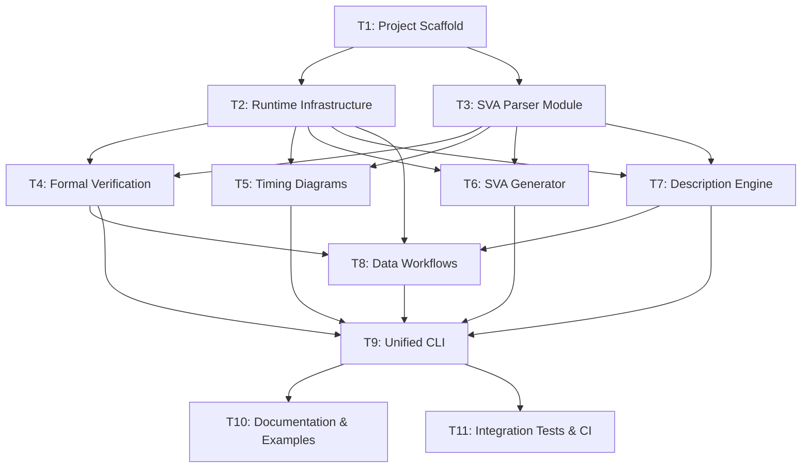

# SVA Toolkit V3 — Shared Worker Collaboration Document

---

# 1. Worker Instructions

**Read this document before starting any task.**

1. **Check task status** — Only work on tasks whose dependencies are all `DONE`. If a dependency is not done, set your task to `BLOCKED` and record the blocker.
2. **Claim your task** — Before starting, update the status table: set status to `IN_PROGRESS`, fill in your worker name, and set the timestamp.
3. **Stay in scope** — Only work on files listed in your task's focus areas. Do not silently change task scope or edit unrelated modules.
4. **Record progress** — If you must stop before completing, update the status table with progress %, record touched files, remaining work, and blockers in the update log.
5. **Coordinate on hot files** — Only T1 and T9 may modify `pyproject.toml` and root `__init__.py`. If you need a dependency added, record it in the update log for T9.
6. **Validate before finishing** — Run the validation steps listed in your task card. Do not mark a task as `DONE` if tests fail.
7. **Update on completion** — Set status to `DONE`, progress to 100%, append a completion entry to the update log with touched files and summary.
8. **Preserve consistency** — Do not contradict the task DAG. If you discover the DAG needs adjustment, record it as a note — do not unilaterally change other tasks.

**Reference documents:**
- `v1/` — V1 source code (read-only reference for porting)
- `v2/sva-tools/` — V2 source code (read-only reference for porting)
- `v1/docs/plans/2026-03-13-robust-sva-toolkit-refactor.md` — Original refactoring plan
- `docs/task_dag_planning.md` — Human-facing planning document (architecture context)

---

# 2. Task DAG Diagram



---

# 3. Task Dependency Table

| Task ID | Task Name | Depends On | Blocks | Parallelizable With | Primary Areas Touched |
|---------|-----------|------------|--------|---------------------|-----------------------|
| T1 | Project Scaffold | — | T2, T3 | — | `v3/sva-toolkit/` (root, pyproject.toml, CI, Makefile) |
| T2 | Runtime Infrastructure | T1 | T4, T5, T6, T7, T8 | T3 | `src/sva_toolkit/runtime/`, `tests/runtime/` |
| T3 | SVA Parser Module | T1 | T4, T5, T6, T7 | T2 | `src/sva_toolkit/sva/`, `tests/sva/` |
| T4 | Formal Verification | T2, T3 | T8, T9 | T5, T6, T7 | `src/sva_toolkit/formal/`, `tests/formal/` |
| T5 | Timing Diagrams | T2, T3 | T9 | T4, T6, T7 | `src/sva_toolkit/timing/`, `tests/timing/` |
| T6 | SVA Generator | T2, T3 | T9 | T4, T5, T7 | `src/sva_toolkit/generate/`, `tests/generate/` |
| T7 | Description Engine | T2, T3 | T8, T9 | T4, T5, T6 | `src/sva_toolkit/describe/`, `tests/describe/` |
| T8 | Data Workflows | T2, T4, T7 | T9 | — | `src/sva_toolkit/data/`, `tests/data/` |
| T9 | Unified CLI | T4, T5, T6, T7, T8 | T10, T11 | — | `src/sva_toolkit/cli/`, `tests/cli/`, `pyproject.toml` |
| T10 | Documentation & Examples | T9 | — | T11 | `README.md`, `docs/`, `examples/` |
| T11 | Integration Tests & CI | T9 | — | T10 | `tests/integration/`, `.github/workflows/ci.yml` |

---

# 4. Task Status Table

| Task ID | Owner / Worker | Status | Progress % | Last Update | Blockers | Next Action |
|---------|---------------|--------|------------|-------------|----------|-------------|
| T1 | Codex | DONE | 100 | 2026-04-13 15:23 CST | — | T2 and T3 may begin from the V3 scaffold |
| T2 | Codex | DONE | 100 | 2026-04-13 15:32 CST | — | Runtime module ported and validated |
| T3 | Codex | DONE | 100 | 2026-04-13 15:35 CST | — | T3 complete; T4, T5, T6, and T7 may proceed against the ported SVA module |
| T4 | Codex | DONE | 100 | 2026-04-13 15:45 CST | — | T4 complete; T8 and T9 may proceed against the ported formal module |
| T5 | Codex | DONE | 100 | 2026-04-13 15:45 CST | — | Timing module ported and validated; T9 may consume T5 once T6/T7/T8 are complete |
| T6 | Codex | DONE | 100 | 2026-04-13 16:08 CST | — | T6 complete; T9 may consume `generate/` once T4, T5, T7, and T8 are also complete |
| T7 | Codex | DONE | 100 | 2026-04-13 15:48 CST | — | T7 complete; T8 may proceed once T4 is done, and T9 may proceed after T4-T8 complete |
| T8 | Codex | DONE | 100 | 2026-04-13 16:11 CST | — | T8 complete; T9 may proceed against the ported `data/` workflows |
| T9 | — | NOT_STARTED | 0 | 2026-04-13 | T4–T8 | Build unified CLI |
| T10 | — | NOT_STARTED | 0 | 2026-04-13 | T9 | Write documentation |
| T11 | — | NOT_STARTED | 0 | 2026-04-13 | T9 | Add integration tests |

---

# 5. Task Detail Cards

## T1: Project Scaffold

- **Objective:** Create the V3 project directory at `v3/sva-toolkit/` with complete package scaffold, `pyproject.toml`, CI, Makefile, and empty subpackage structure.
- **Dependencies:** None
- **Deliverables:**
  - `v3/sva-toolkit/pyproject.toml` (sva-toolkit v3.0.0a1, Python 3.11+, all extras)
  - Directory tree: `src/sva_toolkit/{cli,sva,formal,timing,generate,describe,data,runtime}/`
  - Nested dirs: `formal/backends/`, `sva/lowerings/`, `timing/{core,frontend,bridge,projection,render}/`, `generate/nl/`
  - `tests/` mirroring src structure
  - `.github/workflows/ci.yml`, `Makefile`, `.gitignore`, `README.md`
- **Validation:**
  - [ ] `pip install -e ".[dev]"` succeeds
  - [ ] `ruff check src/` passes
  - [ ] `pytest` runs (0 tests OK)
  - [ ] `python -m build` produces wheel
- **Files touched:** Everything under `v3/sva-toolkit/`
- **Notes:** This is the foundation. All `__init__.py` files should be empty except root (`__version__ = "3.0.0a1"`).

---

## T2: Runtime Infrastructure

- **Objective:** Port V2's runtime module (tools, process, config) and V1's LLM client to `v3/sva-toolkit/src/sva_toolkit/runtime/`.
- **Dependencies:** T1
- **Deliverables:**
  - `runtime/config.py` — ToolkitConfig, ToolConfig
  - `runtime/tools.py` — ToolRegistry, create_default_registry
  - `runtime/process.py` — RunResult, run_tool, make_work_dir
  - `runtime/llm.py` — LLMClient, LLMConfig (lazy openai import)
  - `runtime/__init__.py` — public exports
  - `tests/runtime/` — unit tests (LLM tests use mocks)
- **Validation:**
  - [ ] `pytest tests/runtime/ -q` passes
  - [ ] `ruff check src/sva_toolkit/runtime/`
  - [ ] No import-time side effects
- **Files touched:** `src/sva_toolkit/runtime/*`, `tests/runtime/*`
- **Notes:** Port V2 runtime as-is. LLM client is new — port from V1's `utils/llm_client.py` with env-var config.

---

## T3: SVA Parser Module

- **Objective:** Port V2's custom SVA parser to `v3/sva-toolkit/src/sva_toolkit/sva/`.
- **Dependencies:** T1
- **Deliverables:**
  - All files from V2's `sva/` module: lexer, parser, ast, emitter, errors, analysis, transforms, visitors, lowerings
  - All V2 SVA tests ported
- **Validation:**
  - [ ] `pytest tests/sva/ -q` passes
  - [ ] `ruff check src/sva_toolkit/sva/`
  - [ ] Roundtrip: parse → emit → parse = identical AST
- **Files touched:** `src/sva_toolkit/sva/*`, `tests/sva/*`
- **Notes:** Direct port. Verify all internal imports use `sva_toolkit.sva.*` paths.

---

## T4: Formal Verification

- **Objective:** Port V2's formal verification module to `v3/sva-toolkit/src/sva_toolkit/formal/`.
- **Dependencies:** T2, T3
- **Deliverables:**
  - FormalService, FormalProperty, CheckResult, ImplicationResult
  - EBMC and VCFormal backend adapters
  - Property parsing via `sva.parser`
  - Unit tests with mocked backends
- **Validation:**
  - [ ] `pytest tests/formal/ -q` passes
  - [ ] `ruff check src/sva_toolkit/formal/`
- **Files touched:** `src/sva_toolkit/formal/*`, `tests/formal/*`
- **Notes:** Ensure backends use `runtime.tools` for discovery and `runtime.process` for execution.

---

## T5: Timing Diagrams

- **Objective:** Port V2's timing diagram module to `v3/sva-toolkit/src/sva_toolkit/timing/`.
- **Dependencies:** T2, T3
- **Deliverables:**
  - Complete timing module: frontend, core, bridge, projection, render
  - All V2 timing tests ported
- **Validation:**
  - [ ] `pytest tests/timing/ -q` passes
  - [ ] `ruff check src/sva_toolkit/timing/`
  - [ ] Optional deps (cairosvg, wavedrom) handled with pytest.importorskip
- **Files touched:** `src/sva_toolkit/timing/*`, `tests/timing/*`
- **Notes:** Bridge modules import from `formal.model` — ensure T4 is done or stub the imports.

---

## T6: SVA Generator

- **Objective:** Port V1's SVA generator to `v3/sva-toolkit/src/sva_toolkit/generate/`, adapted to V3 standards.
- **Dependencies:** T2, T3
- **Deliverables:**
  - SVASynthesizer, type system, coverage analysis, NL IR, stratified generation
  - Curated signal presets (replace 20k-line pool)
  - Verible validation via runtime.tools
  - Unit tests
- **Validation:**
  - [ ] `pytest tests/generate/ -q` passes
  - [ ] `ruff check src/sva_toolkit/generate/`
  - [ ] Generated SVA is syntactically valid
- **Files touched:** `src/sva_toolkit/generate/*`, `tests/generate/*`
- **Notes:** Highest adaptation effort. V1's gen/ uses V1 AST types — adapt to V3's `sva.ast` or keep self-contained types.

---

## T7: Description Engine

- **Objective:** Port V1's SVAD translator and CoT builder to `v3/sva-toolkit/src/sva_toolkit/describe/`.
- **Dependencies:** T2, T3
- **Deliverables:**
  - SVADTranslator (from V1's 966-line translator.py)
  - SVACoTBuilder (from V1's cot_builder)
  - Both rewired to use V3's `sva.parser`
  - Unit tests
- **Validation:**
  - [ ] `pytest tests/describe/ -q` passes
  - [ ] `ruff check src/sva_toolkit/describe/`
  - [ ] SVAD output is readable NL; CoT has structured sections
- **Files touched:** `src/sva_toolkit/describe/*`, `tests/describe/*`
- **Notes:** The translator is large (966 lines). Port methodically. May need adapter for V1→V3 AST type mapping.

---

## T8: Data Workflows

- **Objective:** Port V1's dataset builder and benchmark runner to `v3/sva-toolkit/src/sva_toolkit/data/`.
- **Dependencies:** T2, T4, T7
- **Deliverables:**
  - DatasetBuilder using runtime.llm + describe.cot
  - BenchmarkRunner using runtime.llm + formal.service
  - Multiprocessing with caching
  - Offline mode (no LLM)
  - Unit tests with mocked dependencies
- **Validation:**
  - [ ] `pytest tests/data/ -q` passes
  - [ ] `ruff check src/sva_toolkit/data/`
  - [ ] Mocked dataset build produces valid JSONL structure
- **Files touched:** `src/sva_toolkit/data/*`, `tests/data/*`
- **Notes:** Most dependencies of any task. Ensure all upstream modules are stable before starting.

---

## T9: Unified CLI

- **Objective:** Build the `sva` CLI entry point wiring all domain modules.
- **Dependencies:** T4, T5, T6, T7, T8
- **Deliverables:**
  - `cli/main.py` with subcommand groups: parse, formal, timing, generate, describe, data
  - CLI smoke tests via CliRunner
  - Updated `pyproject.toml` scripts entry
- **Validation:**
  - [ ] `sva --help` shows all groups
  - [ ] `pytest tests/cli/ -q` passes
  - [ ] Each subcommand responds to `--help`
- **Files touched:** `src/sva_toolkit/cli/*`, `tests/cli/*`, `pyproject.toml`, `src/sva_toolkit/__init__.py`
- **Notes:** Only task (besides T1) that modifies `pyproject.toml`. Use lazy imports for all domain modules.

---

## T10: Documentation & Examples

- **Objective:** Write comprehensive docs and create runnable examples.
- **Dependencies:** T9
- **Deliverables:**
  - Comprehensive README.md
  - Per-module docs in `docs/`
  - Architecture overview
  - Example files and scripts in `examples/`
- **Validation:**
  - [ ] Example commands work
  - [ ] No broken links
- **Files touched:** `README.md`, `docs/*`, `examples/*`
- **Notes:** Reference V1's docs for content, rewrite for V3 architecture.

---

## T11: Integration Tests & CI

- **Objective:** Add cross-module integration tests and harden CI.
- **Dependencies:** T9
- **Deliverables:**
  - `tests/integration/` with CLI end-to-end and cross-module workflow tests
  - Updated CI workflow
- **Validation:**
  - [ ] `pytest tests/ -q` all pass
  - [ ] CI workflow is green
  - [ ] `python -m build && pip install dist/*.whl && sva --help` works
- **Files touched:** `tests/integration/*`, `.github/workflows/ci.yml`
- **Notes:** Focus on mocked integration tests that don't require external tools.

---

# 6. Update Log

```
[2026-04-13 14:30] [ALL] [planner] Status changed: All tasks initialized as NOT_STARTED.
  Summary: Task DAG created with 11 tasks across 6 execution waves.
  Execution order: T1 → (T2 || T3) → (T4 || T5 || T6 || T7) → T8 → T9 → (T10 || T11)
[2026-04-13 15:23 CST] [T1] [Codex] Status changed: DONE.
  Summary: Created `v3/sva-toolkit/` project scaffold with package/test directory skeleton, packaging metadata, CI workflow, Makefile, `.gitignore`, and placeholder README.
  Touched files: `docs/task_dag_shared.md`, `v3/sva-toolkit/pyproject.toml`, `v3/sva-toolkit/Makefile`, `v3/sva-toolkit/.gitignore`, `v3/sva-toolkit/README.md`, `v3/sva-toolkit/.github/workflows/ci.yml`, `v3/sva-toolkit/src/sva_toolkit/**/__init__.py`, `v3/sva-toolkit/tests/**/__init__.py`, `v3/sva-toolkit/tests/test_version.py`
  Validation: `python -m pip install -e '.[dev]'`, `ruff check src/`, `pytest`, and `python -m build` all succeeded. Added `tests/test_version.py` so plain `pytest` exits cleanly instead of returning code 5 for an empty suite.
[2026-04-13 15:32 CST] [T2] [Codex] Status changed: DONE.
  Summary: Ported the V2 runtime module into `v3/sva-toolkit/src/sva_toolkit/runtime/` and added a new `runtime/llm.py` from V1 with lazy `openai` import, env-backed API key config, and explicit optional-dependency error handling.
  Touched files: `docs/task_dag_shared.md`, `v3/sva-toolkit/src/sva_toolkit/runtime/__init__.py`, `v3/sva-toolkit/src/sva_toolkit/runtime/config.py`, `v3/sva-toolkit/src/sva_toolkit/runtime/tools.py`, `v3/sva-toolkit/src/sva_toolkit/runtime/process.py`, `v3/sva-toolkit/src/sva_toolkit/runtime/llm.py`, `v3/sva-toolkit/tests/runtime/test_config.py`, `v3/sva-toolkit/tests/runtime/test_tools.py`, `v3/sva-toolkit/tests/runtime/test_process.py`, `v3/sva-toolkit/tests/runtime/test_runtime_imports.py`, `v3/sva-toolkit/tests/runtime/test_llm.py`
  Validation: `pytest tests/runtime/ -q` passed (`16 passed`), and `ruff check src/sva_toolkit/runtime/` passed.
[2026-04-13 15:28 CST] [T3] [Codex] Status changed: IN_PROGRESS.
  Summary: Confirmed T1 is DONE, claimed T3, and began a direct V2→V3 port of the custom SVA parser module under `v3/sva-toolkit/src/sva_toolkit/sva/` with matching tests under `v3/sva-toolkit/tests/sva/`.
  Planned validation: `pytest tests/sva/ -q`, `ruff check src/sva_toolkit/sva/`, and roundtrip coverage via the imported V2 test suite.
[2026-04-13 15:35 CST] [T3] [Codex] Status changed: DONE.
  Summary: Ported the full V2 SVA parser module and all V2 SVA tests into V3, preserving module/test structure and V2 `sva.__init__` exports. Applied only minimal fixes for obvious issues found during verification: missing AST imports in `parser.py`, two unused imports flagged by `ruff`, and a scoped dependency port of `timing/core/conditions.py` required by `sva.lowerings.conditions` and `tests/sva/test_condition_lowering.py`.
  Touched files: `docs/task_dag_shared.md`, `v3/sva-toolkit/src/sva_toolkit/sva/__init__.py`, `v3/sva-toolkit/src/sva_toolkit/sva/{ast.py,lexer.py,parser.py,emitter.py,errors.py,analysis.py,transforms.py,visitors.py}`, `v3/sva-toolkit/src/sva_toolkit/sva/lowerings/{__init__.py,conditions.py}`, `v3/sva-toolkit/src/sva_toolkit/timing/core/conditions.py`, `v3/sva-toolkit/tests/sva/{test_parser.py,test_emitter.py,test_roundtrip.py,test_visitors.py,test_condition_lowering.py}`
  Validation: `pytest tests/sva/ -q` → `75 passed`; `ruff check src/sva_toolkit/sva/` → clean; explicit AST roundtrip probe with `PYTHONPATH=src python -c '...'` confirmed parse → emit → parse preserves AST equality for representative expression, sequence, property-body, and property-text cases.
[2026-04-13 15:45 CST] [T4] [Codex] Status changed: DONE.
  Summary: Ported the full V2 formal verification module into `v3/sva-toolkit/src/sva_toolkit/formal/`, preserved the V2 model/parse/normalize behavior, adapted `FormalService` to use V3 `ToolRegistry` discovery, and kept backend subprocess execution on `runtime.process.run_tool`. Added the V2 formal tests plus V3-specific service/backend tests that mock EBMC and VC Formal execution.
  Touched files: `docs/task_dag_shared.md`, `v3/sva-toolkit/src/sva_toolkit/formal/{__init__.py,model.py,parse.py,normalize.py,service.py}`, `v3/sva-toolkit/src/sva_toolkit/formal/backends/{__init__.py,ebmc.py,vcformal.py}`, `v3/sva-toolkit/tests/formal/{test_model.py,test_parse.py,test_service.py}`, `v3/sva-toolkit/tests/formal/backends/{test_ebmc.py,test_vcformal.py}`
  Validation: `env PYTHONPATH=src python -m pytest -q tests/formal` → `26 passed`; `python -m ruff check src/sva_toolkit/formal/` → clean.
[2026-04-13 15:41 CST] [T5] [Codex] Status changed: IN_PROGRESS.
  Summary: Confirmed T2 and T3 are DONE, claimed T5, and started a direct V2→V3 timing port. Initial scope check found the V3 timing tree is mostly empty and that V2 timing bridge code depends on `sva_toolkit.formal.model.FormalProperty`, which is not present in V3 yet.
  Planned validation: `pytest tests/timing/ -q` and `ruff check src/sva_toolkit/timing/`, with optional render-dependency coverage handled via `pytest.importorskip`.
[2026-04-13 15:45 CST] [T5] [Codex] Status changed: DONE.
  Summary: Ported the full V2 timing module and all V2 timing tests into V3, keeping the port direct and merge-friendly. Applied only targeted V3 compatibility changes: added minimal `formal/model.py` and `formal/parse.py` shims required by the timing bridge before T4 lands, switched PNG/WaveDrom renderers to lazy optional-dependency imports, standardized the requested install hint, and fixed timing-only lint issues from the raw V2 port.
  Touched files: `docs/task_dag_shared.md`, `v3/sva-toolkit/src/sva_toolkit/timing/{__init__.py,errors.py}`, `v3/sva-toolkit/src/sva_toolkit/timing/core/{__init__.py,scenario.py,conditions.py,graph.py}`, `v3/sva-toolkit/src/sva_toolkit/timing/frontend/{__init__.py,parser.py,validate.py}`, `v3/sva-toolkit/src/sva_toolkit/timing/bridge/{__init__.py,emit_sva.py,from_sva.py,to_dsl.py,solver.py,ebmc_witness.py}`, `v3/sva-toolkit/src/sva_toolkit/timing/projection/{__init__.py,scenario_view.py,wavedrom_view.py}`, `v3/sva-toolkit/src/sva_toolkit/timing/render/{__init__.py,svg.py,png.py,wavedrom.py,waveform.py}`, `v3/sva-toolkit/src/sva_toolkit/formal/{model.py,parse.py}`, `v3/sva-toolkit/tests/timing/{__init__.py,test_ast_bridge.py,test_conditions.py,test_dag_synthesis.py,test_ebmc_witness.py,test_parser.py,test_render_png.py,test_render_svg.py,test_sva_roundtrip.py}`, `v3/sva-toolkit/tests/timing/{bridge,core,frontend,projection,render}/__init__.py`
  Validation: `pytest tests/timing/ -q` → `75 passed, 1 skipped`; `ruff check src/sva_toolkit/timing/` → clean. The skipped test is the `cairosvg`-gated PNG render test, using `pytest.importorskip` as required.
[2026-04-13 16:08 CST] [T6] [Codex] Status changed: DONE.
  Summary: Ported the V1 SVA generator into `v3/sva-toolkit/src/sva_toolkit/generate/` as the V3 `generate/` package, renamed the main entry point to `synthesizer.py`/`SVASynthesizer`, preserved the NL IR submodule, swapped Verible lookup/execution to `runtime.tools.ToolRegistry` + `runtime.process.run_tool`, replaced the giant expanded signal pool with curated `signal_presets.py`, and added focused V3 tests for batch generation, coverage stats, runtime-backed validation, and NL rendering.
  Touched files: `docs/task_dag_shared.md`, `v3/sva-toolkit/src/sva_toolkit/generate/{__init__.py,synthesizer.py,types.py,coverage.py,templates.py,utils.py,stratified.py,signal_presets.py,arith_weight.json}`, `v3/sva-toolkit/src/sva_toolkit/generate/nl/{__init__.py,ir.py,extractor.py,realizer.py,symbolic.py,templates.py}`, `v3/sva-toolkit/scripts/expand_signal_pool.py`, `v3/sva-toolkit/tests/generate/{test_synthesizer.py,test_presets_and_nl.py}`
  Validation: `pytest tests/generate -q` → `5 passed, 1 skipped`; `ruff check src/sva_toolkit/generate/` → clean; `PYTHONPATH=src python -c '...'` smoke check confirmed `SVASynthesizer.generate_module(..., 3)` produces 3 properties and `compute_coverage_statistics(...)` reports `total_properties == 3`. The Verible integration test is present and auto-skips when `verible-verilog-syntax` is not installed.
[2026-04-13 16:08 CST] [T7] [Codex] Status changed: IN_PROGRESS.
  Summary: Confirmed T2 and T3 are DONE, claimed T7, and began mapping V1's SVAD translator and CoT builder onto the V3 `sva` parser/emitter. The planned approach is a thin describe-local compatibility layer that extracts V1-style structure from `PropertySpec` while preserving the existing template logic.
  Planned validation: `pytest tests/describe/ -q`, `ruff check src/sva_toolkit/describe/`, and targeted sample translations/CoT output checks.
[2026-04-13 15:48 CST] [T7] [Codex] Status changed: DONE.
  Summary: Ported V1's template-based SVAD translator and CoT builder into `v3/sva-toolkit/src/sva_toolkit/describe/`, replacing the Verible-backed `ast_parser` dependency with a describe-local compatibility parser over `sva_toolkit.sva`. The port preserves the V1 translation/CoT templates, accepts raw SVA strings directly, exports a structured `CoTSection` API, and adds describe tests covering translator output plus CoT markdown/section behavior.
  Touched files: `docs/task_dag_shared.md`, `v3/sva-toolkit/src/sva_toolkit/describe/{__init__.py,translator.py,cot.py}`, `v3/sva-toolkit/tests/describe/{test_translator.py,test_cot.py}`
  Validation: `pytest tests/describe/ -q` → `4 passed`; `ruff check src/sva_toolkit/describe/` → `All checks passed!`; targeted sample run via `PYTHONPATH=src python - <<'PY' ...` produced readable SVAD output with signal/reset sections and structured CoT output with five reasoning steps.
[2026-04-13 16:11 CST] [T8] [Codex] Status changed: DONE.
  Summary: Ported the V1 dataset builder and benchmark runner into `v3/sva-toolkit/src/sva_toolkit/data/` as thin V3 adapters over `runtime.llm.LLMClient`, `describe.SVACoTBuilder`, `describe.SVADTranslator`, and `formal.FormalService`. Preserved progress-cache behavior with top-level worker functions for multiprocessing, added offline dataset mode that skips SVAD when no LLM is configured, kept translator fallback for failed LLM description generation, and added focused mocked tests for dataset output structure, cache reuse, benchmark relationship classification, and aggregated metrics.
  Touched files: `docs/task_dag_shared.md`, `v3/sva-toolkit/src/sva_toolkit/data/{__init__.py,dataset.py,benchmark.py}`, `v3/sva-toolkit/tests/data/{test_dataset.py,test_benchmark.py}`
  Validation: `pytest tests/data/ -q` → `11 passed`; `ruff check src/sva_toolkit/data/` → `All checks passed!`
```
