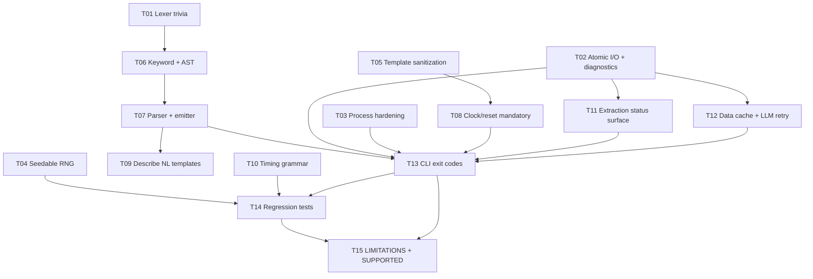

# SVA Toolkit V3 — Shared Worker Collaboration Document

This document is the **single source of truth** for coding workers
executing the gap-remediation plan described in `docs/task_dag_planning.md`.
Workers collaborate across separate conversations and isolated git
worktrees; this file is the only persistent coordination channel.

> Human planning context lives in `docs/task_dag_planning.md`. This file
> is operational — edit it every time you start, pause, or finish a task.

---

## 1. Worker instructions

Read this section before doing any work.

1. **Always read this document first.** Before opening any scaffolded
   source file, load this file and locate your task in §4 (status table)
   and §5 (task detail cards).
2. **Claim one unblocked task.** A task is unblocked iff every task in
   its `Depends on` column is `DONE`. Do **not** pick up a task that is
   already `IN_PROGRESS` by another worker.
3. **Update status before starting.** Flip the task to `IN_PROGRESS`
   in the table in §4 and put your worker handle in the `Owner / worker`
   column.
4. **Work within scope.** Only modify the files listed in your task's
   "Primary areas touched" / "Files likely touched" section. If you
   must touch something else, record the reason in §6 (update log)
   before editing.
5. **Do not silently change task scope.** If requirements shift,
   update the task detail card in §5 and note it in §6.
6. **Record blockers explicitly.** If a dependency is broken or a
   scaffolded file contains something unexpected, set status to
   `BLOCKED`, fill in the `Blockers` column, and add a §6 entry.
7. **Do not edit unrelated tasks.** The status table and the detail
   cards for tasks you do not own are read-only to you, except to mark
   a dependency you delivered (see §4 rules).
8. **Surface partial work.** If you stop before completion, set status
   to `REVIEW_NEEDED` or keep `IN_PROGRESS` and fill in `Next action`
   with concrete, runnable next steps for the next worker. Never leave
   the table stale.
9. **Preserve the DAG.** Do not remove or reorder tasks. If a task must
   be split, append a new row (e.g. `T07a`, `T07b`) and note the split
   in §6.
10. **Always append to the log.** Every status change in §4 must have a
    matching dated entry in §6.

Allowed status values: `NOT_STARTED`, `IN_PROGRESS`, `BLOCKED`,
`REVIEW_NEEDED`, `DONE`.

When you finish a task:

- Run `pytest -q` for the tests your task owns.
- Run `ruff check src tests` on the files you touched.
- Flip your task to `DONE` in §4, update `Last update` with today's
  date (YYYY-MM-DD), set `Progress %` to 100, and clear `Blockers`.
- Append a completion entry to §6.

---

## 2. Task DAG diagram

---

## 3. Task dependency table

| Task ID | Task name                              | Depends on     | Blocks                       | Parallelizable with           | Primary areas touched                                             |
| ------- | -------------------------------------- | -------------- | ---------------------------- | ----------------------------- | ----------------------------------------------------------------- |
| T01     | Lexer trivia & preprocessor            | —              | T06, T07                     | T02, T03, T04, T05            | `src/sva_toolkit/sva/lexer.py`, `sva/trivia.py` (new), `sva/preprocessor.py` (new), `tests/sva/` |
| T02     | Atomic I/O + diagnostics               | —              | T11, T12, T13                | T01, T03, T04, T05            | `src/sva_toolkit/runtime/atomic_io.py` (new), `runtime/diagnostics.py` (new), `tests/runtime/` |
| T03     | Process hardening                      | —              | T13                          | T01, T02, T04, T05            | `src/sva_toolkit/runtime/process.py`, `runtime/errors.py` (new), `tests/runtime/` |
| T04     | Seedable RNG                           | —              | T14                          | T01, T02, T03, T05            | `src/sva_toolkit/generate/rng.py` (new), `generate/synthesizer.py`, `generate/stratified.py`, `generate/utils.py`, `cli/generate_flags.py` (new) |
| T05     | EBMC/VCF template sanitization         | —              | T08                          | T01, T02, T03, T04            | `src/sva_toolkit/formal/sanitize.py` (new), `formal/backends/ebmc.py`, `formal/backends/vcformal.py` |
| T06     | Lexer keyword expansion + AST          | T01            | T07                          | T02, T03, T04, T05 (after T01) | `src/sva_toolkit/sva/lexer.py`, `sva/ast.py`                       |
| T07     | Parser + emitter expansion             | T06            | T09, T13                     | T02, T03, T04, T05, T10, T11  | `src/sva_toolkit/sva/parser.py`, `sva/emitter.py`, `sva/diagnostics.py` (new), `sva/transforms.py`, `sva/visitors.py` |
| T08     | Mandatory clock/reset                  | T05, T07       | T13                          | T09, T10, T11, T12            | `src/sva_toolkit/formal/parse.py`, `formal/model.py`, `formal/service.py`, `cli/formal_flags.py` (new) |
| T09     | Describe NL templates + uncertainty    | T07            | T13 (indirect)               | T08, T10, T11, T12            | `src/sva_toolkit/describe/translator.py`, `describe/cot.py`        |
| T10     | Timing DSL grammar parser              | —              | T14                          | T01–T09, T11, T12             | `src/sva_toolkit/timing/frontend/parser.py`, `timing/frontend/grammar.py` (new), `timing/frontend/validate.py` |
| T11     | Timing extraction status surface       | T02            | T13                          | T07, T08, T09, T10, T12       | `src/sva_toolkit/timing/bridge/from_sva.py`, `timing/bridge/status.py` (new) |
| T12     | Data cache + LLM retry                 | T02            | T13                          | T07, T08, T09, T10, T11       | `src/sva_toolkit/data/dataset.py`, `data/benchmark.py`, `runtime/llm.py`, `runtime/retry.py` (new) |
| T13     | CLI error + exit codes                 | T02, T03, T07, T08, T11, T12 | T14, T15      | —                             | `src/sva_toolkit/cli/main.py`, `cli/exit_codes.py` (new)           |
| T14     | Regression & integration tests         | T01–T13        | T15                          | T15                           | `tests/integration/`, `tests/fixtures/sva_corpus/` (new), `pyproject.toml` (dev extra) |
| T15     | `LIMITATIONS.md` + `SUPPORTED_FEATURES.md` | T01–T14    | —                            | T14                           | `docs/LIMITATIONS.md` (new), `docs/SUPPORTED_FEATURES.md` (new)    |

---

## 4. Task status table

| Task ID | Owner / worker | Status      | Progress % | Last update | Blockers | Next action                                                                 |
| ------- | -------------- | ----------- | ---------- | ----------- | -------- | --------------------------------------------------------------------------- |
| T01     | Codex          | DONE        | 100        | 2026-04-20  | —        | Landed lexer trivia + preprocessor support; T06 can build on the stabilized token stream |
| T02     | Codex          | DONE        | 100        | 2026-04-20  | —        | Delivered atomic writers, diagnostics/logging, exports, and runtime tests    |
| T03     | Codex-T03      | DONE        | 100        | 2026-04-20  | —        | Delivered process-group timeout handling, typed `ToolMissingError`, and runtime regression tests |
| T04     | codex-t4       | DONE        | 100        | 2026-04-20  | —        | Delivered seedable `GenerationRng`, CLI `--seed`, determinism tests; T14 now unblocked |
| T05     | codex-t05      | DONE        | 100        | 2026-04-20  | —        | Sanitizer landed; T08 can reuse `formal/sanitize.py` while removing defaults |
| T06     | Codex-T06      | DONE        | 100        | 2026-04-20  | —        | Expanded lexer keyword/operator coverage, added placeholder AST nodes, and passed `pytest -q sva-toolkit/tests/sva` plus `ruff check` |
| T07     | Codex-T07      | DONE        | 100        | 2026-04-20  | —        | Expanded parser/emitter coverage, surfaced opaque diagnostics, and passed `pytest -q tests/sva` plus `ruff check src tests` |
| T08     | Codex-T08      | DONE        | 100        | 2026-04-20  | —        | Removed silent formal defaults, added explicit clock/reset CLI registration, and verified reset semantic normalization |
| T09     | Codex-T09      | DONE        | 100        | 2026-04-20  | —        | Added describe-system-function templates, `[unverified]` opaque markers, CoT low-confidence surfacing, and passing describe regression coverage |
| T10     | Codex-T10      | DONE        | 100        | 2026-04-20  | —        | Replaced the regex table with a grammar parser, added line:col diagnostics, and locked example output hashes plus negative coverage |
| T11     | Codex-T11      | DONE        | 100        | 2026-04-20  | —        | `ExtractionReport` now flows through timing extraction/bundling and is ready for T13 exit-code handling |
| T12     | Codex-T12      | DONE        | 100        | 2026-04-20  | —        | Landed schema-tagged locked cache writes, LLM retry/backoff, translator-fallback diagnostics, and task-owned data tests |
| T13     | Codex-T13      | DONE        | 100        | 2026-04-20  | —        | Landed typed CLI exit codes, global verbose traceback mode, diagnostics summaries, and composed T04/T08/T11 CLI helpers |
| T14     | —              | NOT_STARTED | 0          | 2026-04-19  | T01–T13  | Wait for integration landing, then build adversarial + regression suite     |
| T15     | Codex-T15      | BLOCKED     | 90         | 2026-04-20  | T14 not landed; integration/regression suite still scaffolded | Reconcile `LIMITATIONS.md` / `SUPPORTED_FEATURES.md` against the final T14 regression landing, then flip to `DONE` if no capability or limitation inventory changes |

---

## 5. Task detail cards

### T01 — Lexer trivia & preprocessor

- **Objective:** Make the lexer tolerant to `//`, `/* */`, string
  literals, backtick directives, escaped identifiers, line
  continuations, and attribute instances.
- **Dependency prerequisites:** none.
- **Expected deliverables:** trivia & preprocessor modules, `STRING`
  token kind, new lexer unit tests, no regressions in existing tests.
- **Validation checklist:**
  - [ ] Every `examples/sva/*.sv` tokenizes after the file is prefixed
        with `// hdr` and an inline `/* block */`.
  - [ ] `` `define WIDTH 8`` accepted by the preprocessor layer.
  - [ ] Unterminated string raises `SvaSyntaxError`.
  - [ ] `ruff check src/sva_toolkit/sva tests/sva` clean.
- **Files likely touched:** `sva/lexer.py`, `sva/trivia.py` (new),
  `sva/preprocessor.py` (new), `tests/sva/test_lexer_trivia.py` (new),
  `tests/sva/test_lexer_preprocessor.py` (new).
- **Notes for future workers:** Do not add keyword tokens; that is T06.

### T02 — Atomic I/O + diagnostics

- **Objective:** Centralize atomic writes and diagnostic surfacing.
- **Dependency prerequisites:** none.
- **Expected deliverables:** `atomic_write_text/json/jsonl`,
  `Diagnostics` collector, `configure_cli_logging`, unit tests.
- **Validation checklist:**
  - [ ] Atomic write simulated failure leaves target unchanged.
  - [ ] Concurrent writes produce one coherent file.
  - [ ] Diagnostics aggregator renders a deterministic summary.
- **Files likely touched:** `runtime/atomic_io.py` (new),
  `runtime/diagnostics.py` (new), `runtime/__init__.py`,
  `tests/runtime/test_atomic_io.py` (new),
  `tests/runtime/test_diagnostics.py` (new).
- **Notes:** No call-site migration here; T08/T11/T12/T13 adopt these.

### T03 — Process hardening

- **Objective:** Kill process groups on timeout; typed `ToolMissingError`.
- **Dependency prerequisites:** none.
- **Expected deliverables:** updated `run_tool`, `errors.py`,
  regression tests including an orphan-reaping test on POSIX.
- **Validation checklist:**
  - [ ] Grandchild is reaped when `run_tool` times out.
  - [ ] `ToolMissingError` raised for absent binary.
  - [ ] `make_work_dir` mode is `0o700` on POSIX.
- **Files likely touched:** `runtime/process.py`, `runtime/errors.py`
  (new), `tests/runtime/test_process.py`,
  `tests/runtime/test_process_orphans.py` (new).
- **Notes:** Document Windows orphan-kill caveat for T15.

### T04 — Seedable RNG

- **Objective:** Eliminate non-determinism in `generate/`.
- **Dependency prerequisites:** none.
- **Expected deliverables:** `GenerationRng`, all generators
  parameterized, `--seed` CLI flag helper.
- **Validation checklist:**
  - [ ] Two runs with the same seed produce byte-equal output.
  - [ ] No `random.<x>` module-level calls in `generate/`.
  - [ ] Seed echoed to stderr when omitted.
- **Files likely touched:** `generate/rng.py` (new),
  `generate/synthesizer.py`, `generate/stratified.py`,
  `generate/utils.py`, `cli/generate_flags.py` (new),
  `tests/generate/test_determinism.py` (new).
- **Notes:** T13 will mount the flag registration module.

### T05 — Template sanitization

- **Objective:** Validate identifiers and escape bodies before splicing
  into EBMC / VC Formal module templates.
- **Dependency prerequisites:** none.
- **Expected deliverables:** `formal/sanitize.py`, migrated backends,
  unit tests.
- **Validation checklist:**
  - [ ] Reserved-word signal is rejected.
  - [ ] Hierarchical identifier is rejected.
  - [ ] Body containing `{`/`}` does not crash template rendering.
- **Files likely touched:** `formal/sanitize.py` (new),
  `formal/backends/ebmc.py`, `formal/backends/vcformal.py`,
  `tests/formal/test_sanitize.py` (new).
- **Notes:** Keep the public backend API surface unchanged.

### T06 — Lexer keyword expansion + AST nodes

- **Objective:** Recognize every missing SVA keyword and carve AST
  placeholders.
- **Dependency prerequisites:** T01.
- **Expected deliverables:** expanded `_KEYWORDS`, new `TokenKind`
  values, placeholder AST dataclasses, parametrized lexer tests.
- **Validation checklist:**
  - [ ] Every new keyword has a lexer test.
  - [ ] Existing parser tests remain green (no parser changes yet).
- **Files likely touched:** `sva/lexer.py`, `sva/ast.py`,
  `tests/sva/test_lexer_*.py`.
- **Notes:** Parser behavior intentionally unchanged — T07 owns that.

### T07 — Parser + emitter expansion

- **Objective:** Full grammar coverage for the constructs in §2.1–§2.8
  and visible opaque-downgrade diagnostics.
- **Dependency prerequisites:** T06.
- **Expected deliverables:** parser extensions, emitter round-trip
  support, `sva/diagnostics.py`, extensive new tests.
- **Validation checklist:**
  - [ ] Every new construct round-trips via parse + emit.
  - [ ] `opaque_count == 0` over `examples/sva/`.
  - [ ] Opaque fallback logs WARNING and bumps counter.
- **Files likely touched:** `sva/parser.py`, `sva/emitter.py`,
  `sva/diagnostics.py` (new), `sva/transforms.py`, `sva/visitors.py`,
  `tests/sva/test_parser_temporal.py` (new),
  `tests/sva/test_parser_structural.py` (new),
  `tests/sva/test_opaque_diagnostics.py` (new).
- **Notes:** If scope grows, split into T07a (temporal) / T07b
  (structural) and note in §6.

### T08 — Mandatory clock/reset

- **Objective:** No more silent `clk`/`!rst_n` defaults.
- **Dependency prerequisites:** T05, T07.
- **Expected deliverables:** typed errors, CLI flags, semantic reset
  comparator, tests.
- **Validation checklist:**
  - [ ] Missing clocking raises `MissingClockingError`.
  - [ ] `!rst_n` ≡ `rst_n == 0` holds in equivalence.
  - [ ] `sva formal check --clock hclk --reset rst_n` works.
- **Files likely touched:** `formal/parse.py`, `formal/model.py`,
  `formal/service.py`, `cli/formal_flags.py` (new), formal tests.
- **Notes:** CLI flag module is mounted by T13.

### T09 — Describe NL templates + uncertainty

- **Objective:** Fill missing NL templates, mark opaque passthrough.
- **Dependency prerequisites:** T07.
- **Expected deliverables:** template coverage, `[unverified]` marker,
  tests.
- **Validation checklist:**
  - [ ] Every lexed `$ident` has a template or is explicitly exempt.
  - [ ] Opaque nodes surface as `[unverified]` in both SVAD and CoT.
- **Files likely touched:** `describe/translator.py`, `describe/cot.py`,
  `tests/describe/test_uncertainty.py` (new).
- **Notes:** Preserve public `translate()` / `build()` signatures.

### T10 — Timing DSL grammar parser

- **Objective:** Replace regex-per-line DSL parser with a grammar.
- **Dependency prerequisites:** none.
- **Expected deliverables:** `timing/frontend/grammar.py`, rewritten
  parser, tests.
- **Validation checklist:**
  - [ ] Every existing `.td` example parses.
  - [ ] Trailing `# …` comments tolerated.
  - [ ] Multi-line declarations parse.
- **Files likely touched:** `timing/frontend/parser.py`,
  `timing/frontend/grammar.py` (new), `timing/frontend/validate.py`,
  `tests/timing/test_grammar_parser.py` (new).
- **Notes:** Core / bridge / render APIs unchanged.

### T11 — Timing extraction status surface

- **Objective:** Bubble `LOSSY`/`UNSUPPORTED` to the CLI.
- **Dependency prerequisites:** T02.
- **Expected deliverables:** `ExtractionReport`, targeted exception
  handling, tests.
- **Validation checklist:**
  - [ ] Unsupported input yields a non-EXACT report with reasons.
  - [ ] Clean input yields `EXACT` and an empty reasons list.
- **Files likely touched:** `timing/bridge/from_sva.py`,
  `timing/bridge/status.py` (new),
  `tests/timing/test_extraction_status.py` (new).
- **Notes:** T13 consumes the report to decide exit code 6.

### T12 — Data cache + LLM retry

- **Objective:** Safe multiprocessing cache and resilient LLM client.
- **Dependency prerequisites:** T02.
- **Expected deliverables:** atomic+locked cache writes, retry
  decorator, `svad_source` visibility, tests.
- **Validation checklist:**
  - [ ] Parallel stress produces no corrupted JSON.
  - [ ] 429 then 200 → retry succeeds.
  - [ ] Persistent 500 → fallback logged and counted.
- **Files likely touched:** `data/dataset.py`, `data/benchmark.py`,
  `runtime/llm.py`, `runtime/retry.py` (new),
  `tests/data/test_cache_locking.py` (new),
  `tests/data/test_llm_retry.py` (new).
- **Notes:** Keep public `DatasetBuilder`/`BenchmarkRunner` stable.

### T13 — CLI error + exit codes

- **Objective:** Typed exit codes and composed per-task flag modules.
- **Dependency prerequisites:** T02, T03, T07, T08, T11, T12.
- **Expected deliverables:** `cli/exit_codes.py`, updated
  `_handle_cli_errors`, `--verbose`, end-of-run diagnostics summary.
- **Validation checklist:**
  - [ ] Missing backend → exit 3.
  - [ ] Parse error → exit 4.
  - [ ] Timeout → exit 5.
  - [ ] Lossy extraction → exit 6.
- **Files likely touched:** `cli/main.py`, `cli/exit_codes.py` (new),
  `tests/cli/test_exit_codes.py` (new).
- **Notes:** Exclusive edit wave on `cli/main.py`.

### T14 — Regression, determinism, concurrency tests

- **Objective:** Prevent every fixed gap from re-opening.
- **Dependency prerequisites:** T01–T13.
- **Expected deliverables:** integration tests, fixtures, optional
  `pytest-cov` wiring.
- **Validation checklist:**
  - [ ] Every R1–R18 has at least one regression test.
  - [ ] `pytest -q` green on clean checkout.
- **Files likely touched:** `tests/integration/*` (new),
  `tests/fixtures/sva_corpus/*` (new), `pyproject.toml` (dev extra).
- **Notes:** No source-code changes.

### T15 — `LIMITATIONS.md` + `SUPPORTED_FEATURES.md`

- **Objective:** Publish the user-facing feature + limitation
  inventories requested by the project brief.
- **Dependency prerequisites:** T01–T14.
- **Expected deliverables:** two CommonMark docs with unique IDs and
  cross-links, pointer added at the bottom of `docs/gaps.md`.
- **Validation checklist:**
  - [ ] Every unfixed gaps.md item appears with a `L-xx` ID.
  - [ ] Every supported feature has a `F-xx` ID.
  - [ ] Both docs render cleanly in GitHub preview.
- **Files likely touched:** `docs/LIMITATIONS.md` (new),
  `docs/SUPPORTED_FEATURES.md` (new), bottom of `docs/gaps.md`.
- **Notes:** Link — do not duplicate — gap content.

---

## 6. Update log

Format: `YYYY-MM-DD HH:MM — T<id> — <owner> — <status transition> — <one-line note>`.
Append new entries at the bottom. Never rewrite history.

- 2026-04-19 — scaffolder — created — Planning + shared docs authored;
  project scaffold laid out; all tasks seeded as NOT_STARTED.
- 2026-04-20 17:54 — T01 — Codex — NOT_STARTED -> IN_PROGRESS — Claimed lexer trivia and preprocessor tolerance task; reading docs and scaffolded files.
- 2026-04-20 18:04 — T01 — Codex — IN_PROGRESS -> IN_PROGRESS — Temporarily touching `tests/timing/*` only to clear pre-existing unused-import lint failures that block required `ruff check src tests` validation.
- 2026-04-20 18:05 — T01 — Codex — IN_PROGRESS -> DONE — Added trivia/preprocessor-aware lexing, new lexer tests, example corpus tokenization sweep, and cleared the repo-wide lint gate.

<!-- Append new log entries below this line. -->
- 2026-04-20 19:55 — T08 — Codex-T08 — NOT_STARTED -> IN_PROGRESS — Claimed mandatory clock/reset task; validating parse/model/service and CLI flag seams against T05/T07 outputs.
- 2026-04-20 20:27 — T08 — Codex-T08 — scope note — Touched `src/sva_toolkit/timing/bridge/from_sva.py` minimally so timing extraction can keep its existing optional-reset behavior while `formal.parse_property()` becomes strict by default for formal flows.
- 2026-04-20 20:27 — T08 — Codex-T08 — IN_PROGRESS -> DONE — Removed hard-coded formal clock/reset defaults, added typed missing-annotation errors plus reset semantic normalization, landed `cli/formal_flags.py`, and passed targeted pytest + broader timing/CLI regression sweeps with clean ruff.
- 2026-04-20 10:28 — T04 — codex-t4 — NOT_STARTED -> IN_PROGRESS — Claimed seedable RNG task; auditing `generate/` call-sites and CLI integration.
- 2026-04-20 11:02 — T04 — codex-t4 — scope note — Touched `tests/timing/test_dag_synthesis.py` and `tests/timing/test_ebmc_witness.py` only to remove pre-existing unused imports so required `ruff check src tests` would pass cleanly.
- 2026-04-20 11:04 — T04 — codex-t4 — IN_PROGRESS -> DONE — Added `GenerationRng`, threaded RNG through `generate/`, mounted CLI `--seed`, printed implicit seeds to stderr, and landed determinism coverage with passing pytest + ruff.
- 2026-04-20 15:44 — T02 — Codex — NOT_STARTED -> IN_PROGRESS — Claimed task, reviewed docs, and aligned design against runtime/test scaffolds.
- 2026-04-20 15:57 — T02 — Codex — IN_PROGRESS -> DONE — Implemented atomic I/O and diagnostics helpers; `pytest -q tests/runtime` and `ruff check` passed.
- 2026-04-20 17:56 — T05 — codex-t05 — NOT_STARTED -> IN_PROGRESS — Claimed template sanitization; validating current backends and replacing scaffolded sanitizer/tests.
- 2026-04-20 18:03 — T05 — codex-t05 — IN_PROGRESS -> DONE — Added shared formal sanitizer, migrated EBMC/VCF templates off `str.format`, and passed `pytest -q tests/formal` plus `ruff check` on touched files.
- 2026-04-20 18:00 — T03 — Codex-T03 — NOT_STARTED -> IN_PROGRESS — Claimed task and began runtime/process hardening plus typed tool-error work.
- 2026-04-20 18:10 — T03 — Codex-T03 — IN_PROGRESS -> DONE — Added POSIX process-group timeout cleanup, typed `ToolMissingError`, runtime orphan regression coverage, and flagged the Windows caveat for T15/LIMITATIONS.
- 2026-04-20 18:31 — T06 — Codex-T06 — NOT_STARTED -> IN_PROGRESS — Claimed lexer keyword expansion + AST task; auditing token coverage, placeholder nodes, and lexer-owned tests before implementation.
- 2026-04-20 18:45 — T06 — Codex-T06 — IN_PROGRESS -> DONE — Added missing keyword/operator tokens, placeholder AST nodes and exports, lexer coverage, and passed `pytest -q sva-toolkit/tests/sva` plus `ruff check`.
- 2026-04-20 19:00 — T07 — Codex-T07 — NOT_STARTED -> IN_PROGRESS — Claimed parser/emitter expansion; auditing T06 AST placeholders, parser/emitter scaffolds, and diagnostics integration points.
- 2026-04-20 19:09 — T07 — Codex-T07 — scope note — Touching `sva/lexer.py` minimally to add brace-token support required for `inside` / `dist`, which cannot be parsed from the existing token stream.
- 2026-04-20 19:42 — T07 — Codex-T07 — IN_PROGRESS -> DONE — Landed parser/emitter coverage for temporal and structural constructs, added visible opaque fallback diagnostics, verified `examples/sva` with `opaque_count == 0`, and passed `pytest -q tests/sva` plus `ruff check src tests`.
- 2026-04-20 20:21 — T09 — Codex-T09 — DONE — Expanded describe-system-function templates, surfaced `[unverified]` opaque fragments in SVAD and low-confidence CoT output, added examples-tree coverage plus uncertainty regressions, and passed targeted pytest + ruff.
- 2026-04-20 20:32 — T11 — Codex-T11 — scope note — Touched `sva-toolkit/src/sva_toolkit/cli/main.py` and existing timing tests to thread the new extraction-report return value through the public API and CLI.
- 2026-04-20 20:32 — T11 — Codex-T11 — NOT_STARTED -> DONE — Added `ExtractionReport`, replaced broad timing bridge catches with typed reportable failures, surfaced warnings to the CLI, and passed targeted `pytest` plus `ruff check`.
- 2026-04-20 20:35 — T10 — Codex-T10 — NOT_STARTED -> DONE — Replaced the timing regex parser with a tokenized recursive-descent grammar, added `TimingSyntaxError` line:col diagnostics plus hash-comment/multiline coverage, and passed `pytest -q sva-toolkit/tests/timing`, integration timing tests, and `ruff check` on touched files.
- 2026-04-20 20:03 — T12 — Codex-T12 — NOT_STARTED -> IN_PROGRESS — Claimed data cache + LLM retry task; auditing T02 helpers, cache call-sites, retry paths, and task-owned tests before implementation.
- 2026-04-20 20:32 — T12 — Codex-T12 — scope note — Added `src/sva_toolkit/data/cache.py` to share schema-tagged, advisory-locked cache helpers across dataset and benchmark flows instead of duplicating lock/write logic.
- 2026-04-20 20:32 — T12 — Codex-T12 — IN_PROGRESS -> DONE — Replaced cache writes with atomic+locked schema-tagged JSON, added configurable LLM retry/backoff with `Retry-After`, surfaced translator fallback through diagnostics/logging, and passed `pytest -q tests/data/test_dataset.py tests/data/test_benchmark.py tests/data/test_cache_locking.py tests/data/test_llm_retry.py` plus `ruff check` on touched files.
- 2026-04-20 22:05 — T13 — Codex-T13 — scope note — Touched `sva-toolkit/src/sva_toolkit/runtime/diagnostics.py` to make CLI logging reuse the current stderr safely across repeated Click invocations, and `sva-toolkit/src/sva_toolkit/data/dataset.py` so LLM timeout failures surface as fatal exit-code-5 conditions instead of being swallowed by translator fallback.
- 2026-04-20 22:05 — T13 — Codex-T13 — NOT_STARTED -> DONE — Replaced catch-all CLI error handling with stable typed exit codes, mounted the T04/T08/T11 CLI helper modules, added global `--verbose` traceback output plus end-of-run diagnostics summaries, and passed `pytest -q tests/data/test_llm_retry.py tests/runtime/test_diagnostics.py tests/cli/test_exit_codes.py tests/cli/test_main.py tests/formal/test_clock_reset_flags.py` with clean `ruff check`.
- 2026-04-20 23:02 — T15 — Codex-T15 — NOT_STARTED -> BLOCKED — Authored `docs/LIMITATIONS.md` and `docs/SUPPORTED_FEATURES.md`, added the pointer section in `docs/gaps.md`, and verified unique `L-xx` / `F-xx` IDs; leaving the task blocked because T14 is still `NOT_STARTED` and the docs need a final post-T14 reconciliation pass before they can be claimed as canonical.
